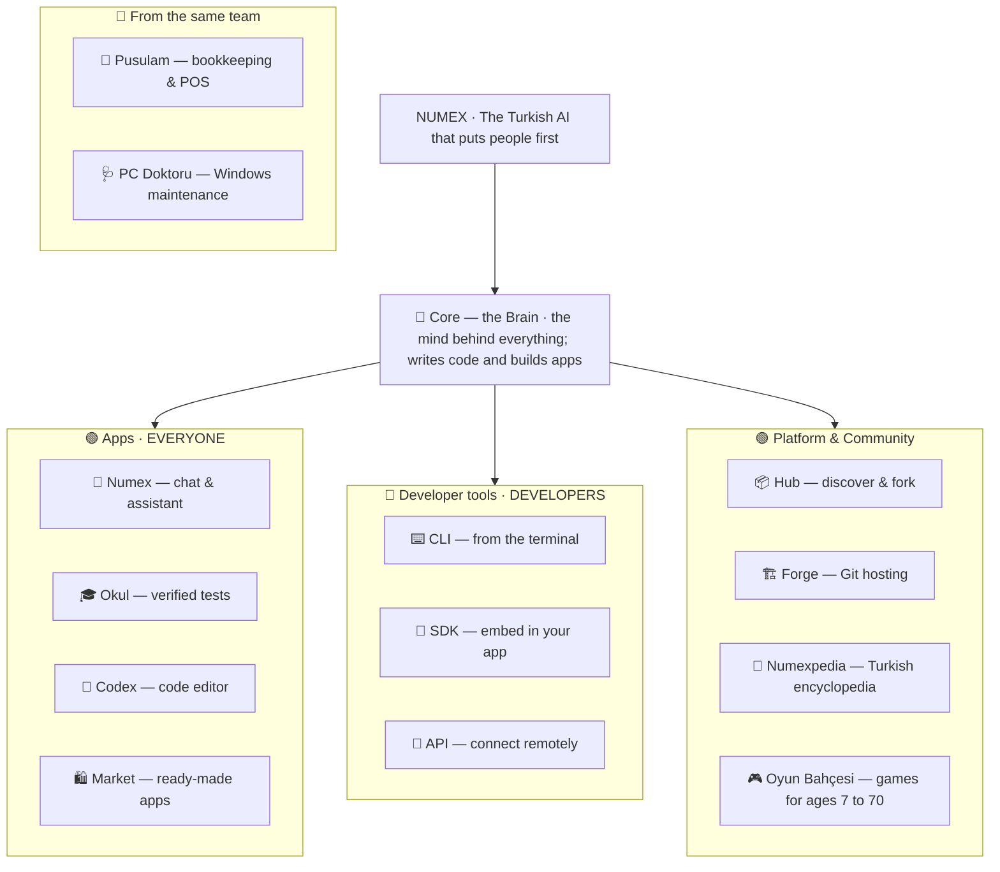

<div align="center">


# ◆ Numex AI

## Türkiye's homegrown AI ecosystem

**Chat · Coding agent · CLI · API · Verified tests · Open-source app market · Git hosting · Encyclopedia**
Turkish-first by design — data stays in Türkiye, KVKK (Turkish GDPR) compliant.

[](https://numexai.com.tr)
[](#-story)
[](LICENSE)

🇹🇷 [Türkçe](README.md) · 🇬🇧 **English**

</div>

---

> *"Why is there no AI that speaks Turkish and understands Turkish culture?"*
> Numex started with that question in Istanbul in **2021**. Today it is a family of products running
> on a single brain — **"One mind, many doors. Not a tool — a companion."**

## ◆ At a glance

| | |
|---|---|
| **2021** | Founded in Istanbul by Nurullah Şahin |
| **16+** | Products in the Numex family |
| **5-stage** | Pipeline that turns every answer into natural Turkish |
| **128K** | Token context window |
| **44** | Open-source apps in Numex Market, all built autonomously |
| **28** | Articles in Numexpedia, a free Turkish encyclopedia |
| **2 × 256 GB** | RAM, dual-server infrastructure in Türkiye |
| **100,000** | Free API tokens on sign-up |

**One account, the whole family:** sign in once with Google or GitHub for the web app, CLI, Codex,
Hub and Forge.

## 🗺️ The Numex family



| Product | For | What it does | Link |
|---|---|---|---|
| 💬 **Numex AI** | Everyone | Turkish chat, code, documents, web search, vision, voice, cultural characters, Agent mode | [numexai.com.tr](https://numexai.com.tr) |
| 🎓 **Numex Okul** | Students, parents, teachers | One AI writes each question, a second AI solves it independently; mismatches are discarded. LGS/TYT/AYT exam prep, driving test; solve on screen or export PDF | [okul.numexai.com.tr](https://okul.numexai.com.tr) |
| 🧩 **Numex Codex** | Developers | Turkish coding agent: browser editor, desktop IDE (v2.9.59, VS Code based), VS Code extension. Modes: Chat · Plan · Autonomous · Bug Hunter | [codex.numexai.com.tr](https://codex.numexai.com.tr) |
| 🛍️ **Numex Market** | Everyone | 44 free, open-source apps Numex built autonomously, in 7 categories — try live, read the source, fork | [market.numexai.com.tr](https://market.numexai.com.tr) |
| ⌨️ **Numex CLI** | Developers | Autonomous agent in the terminal (v3.3.10): plan mode, long-running missions, undo, offline via Ollama, remote-PC bridge, MCP | `npm i -g @numexai/cli` |
| 🧰 **Codex SDK** | Developers | chat · embeddings · images · models · search + a CLI Bridge to embed the agent anywhere | `npm i numexcodex-sdk` |
| 🔌 **Developer API** | Teams | REST v1 with `numex-pro`, `numex-fast`, `numex-think`, `numex-vision`, `numex-code`; streaming, function calling | [API docs](urunler/05-api-ve-sdk.md) |
| 📦 **Numex Hub** | Developers | AI that knows your repo: ask for a change, review it, apply → committed. Community showcase, trending repos, live feed | [hub.numexai.com.tr](https://hub.numexai.com.tr) |
| 🏗️ **Numex Forge** | Developers | Gitea-based Git server with a fully Turkish UI | [forge.numexai.com.tr](https://forge.numexai.com.tr) |
| 📖 **Numexpedia** | Everyone | Computing, AI and software explained in plain Turkish — free and open | [pedia.numexai.com.tr](https://pedia.numexai.com.tr) |
| 🧭 **Pusulam** | SMEs | Bookkeeping & point of sale | [pusulamx.com.tr](https://pusulamx.com.tr) |
| 🩺 **PC Doktoru** | Windows users | Portable AI maintenance, diagnosis and repair with autonomous mode and rollback | [pcdoktoru.com.tr](https://pcdoktoru.com.tr) |

## ⚡ What makes Numex different

**Not a raw API wrapper.** Numex wraps leading model providers with its own engines:

1. **Pipeline** — every request goes through 5 stages: prompt enrichment → model → Turkish correction
   & tone → quality check → answer. Stage 2A alone improved Turkish output quality by 30% in v3.1.
2. **Detective Mode™** — for critical questions, several models solve the same problem independently
   (fast, deep, alternative) and a referee picks the best answer *with its reasoning*.
   *"One model can be wrong. Three at once won't be."*
3. **Multi-Agent** — an orchestrator splits complex requests into sub-tasks for specialist agents and
   merges the result into one consistent answer.
4. **DeepView™** — multi-expert orchestration that produces a single *Master Plan* and shows how the
   AI thinks across 6 layers.
5. **Numex Core** — the agent engine behind Codex and the CLI: a 4-agent **Swarm Council**
   (Architect, Coder, Auditor, Designer), a **self-healing loop**, **Omni-Vision** (headless-browser
   DOM/3D checks), 3-tier inference (local ONNX WASM → Ollama → cloud), and **FinishGate**: a task
   cannot be marked "done" without live evidence — HTTP 200, passing tests, or DOM checks.

**Proof over claims** runs through the whole family: Detective Mode in chat, dual-AI verification
in Okul, FinishGate in code — and Numex Market, where 44 autonomously built, verified apps are open
for anyone to inspect.

## 🇹🇷 Cultural characters

Call them with `@`: **@FatmaAna** (cooking, home economics), **@MuhasebeciYunus** (tax, VAT,
e-invoicing), **@LokmanHekim** (healthy living), **@HaciBayramHoca** (spiritual questions),
**@Üstat**, **@Avukat**, **@Kod** and more. Each has its own domain and tone.

## 👩‍💻 For developers

```bash
npm i -g @numexai/cli
numex login
numex "build a dark-themed todo app"
numex plan "add a payment module"      # plan only, no edits
numex mission "make the tests pass"    # long-running autonomous mission
numex undo                             # roll back the last turn
```

```javascript
const { Numex } = require('numexcodex-sdk');
const numex = new Numex({ apiKey: process.env.NUMEX_API_KEY });
await numex.chat.completions.create({ messages: [{ role: 'user', content: 'Merhaba' }] });
```

The agent keeps an open, readable **`.numex/`** folder in every project — RAG index, audit trail,
checkpoints, learned errors — so you can always see what it knows and what it did.

## 💳 Pricing

| Free | Starter PRO | Numex PRO ⭐ | Advanced |
|---|---|---|---|
| ₺0 · 15 msgs/day · 8K context | ₺99/mo · 50/day · 32K | ₺399/mo · unlimited · 128K · CLI + API | ₺599/mo · unlimited · 128K · 3 seats · custom characters |

Plus pay-as-you-go credits, non-renewing time passes (8 hours for ₺29), and guest use without sign-up.
Market, Numexpedia and Oyun Bahçesi are free. *See [numexai.com.tr](https://numexai.com.tr) for current prices.*

## 🔒 Privacy

Data is processed and stored in Türkiye (KVKK compliant) on a dual-server setup. In Codex and the
CLI the agent works on your own machine and asks before it acts; every change is shown as a diff,
logged, and reversible.

## 🏔️ Story

| Year | Milestone |
|---|---|
| 2021 | The first lines are written in the back room of a photography studio in Istanbul |
| 2023 | The Pipeline engine |
| 2024 | Detective Mode™ |
| 2025 | v3.0 rewrite, public API, characters, dual-server infrastructure; DeepView™ |
| 2026 | v3.1 public release; the Numex family: Codex, CLI, Okul, Market, Numexpedia, Hub & Forge |

The logo hides a secret: it reads as a modern AI symbol, but **turn it 180°** and it becomes the
8-pointed star of Seljuk architecture. *Two identities, one symbol.*
→ [Brand story](urunler/17-marka-kimligi.md)

> *"AI should support people, not replace them."* — Nurullah Şahin, founder

## 🤝 Contributing

This is Numex's open showcase and documentation repo. Fixes, translations, examples and articles are
welcome — see [CONTRIBUTING.md](CONTRIBUTING.md).

📧 destek@numexai.com.tr · 🌐 [numexai.com.tr](https://numexai.com.tr)
