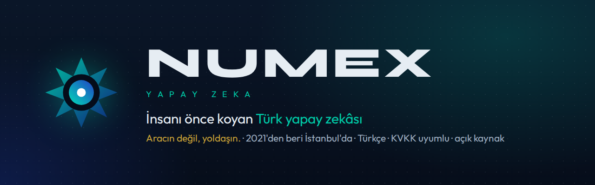
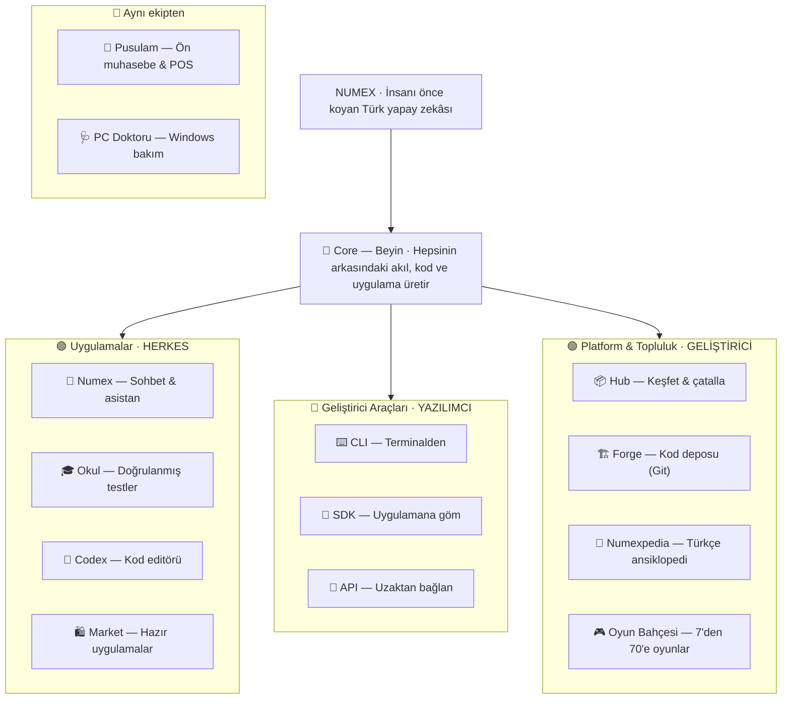
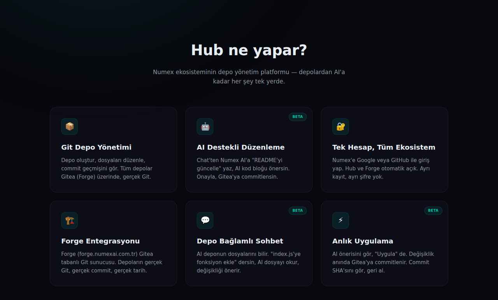
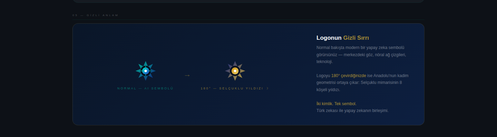

<div align="center">



# ◆ Numex AI

## Türkiye'nin yerli yapay zeka ekosistemi

**Sohbet · Kod · Otonom ajanlar · Belge analizi · Web araması · Terminal · Editör · API**
Türkçe'ye ve Türk kullanıcısına özel — verileri Türkiye'de, KVKK uyumlu.

[](https://numexai.com.tr)
[](docs/yol-haritasi.md)
[](#-hikaye)
[](urunler/12-guvenlik-kvkk.md)
[](urunler/05-api-ve-sdk.md)
[](LICENSE)

🇹🇷 **Türkçe** · 🇬🇧 [English](README.en.md)

[🚀 Ücretsiz başla](https://numexai.com.tr) ·
[🧩 Ürünler](urunler/) ·
[👨‍👩‍👧‍👦 Aile](urunler/15-numex-ailesi.md) · [🏗️ Mimari](docs/mimari.md) ·
[🗺️ Yol haritası](docs/yol-haritasi.md) ·
[❓ SSS](docs/sss.md) ·
[📚 Makaleler](makaleler/)

</div>

---

> *"Türkçe konuşan, Türk kültürünü anlayan bir yapay zeka neden yok?"*
> Numex AI bu soruyla **2021**'de İstanbul'da yola çıktı. Bugün web'den terminale, editörden
> Windows masaüstüne, işletme yazılımından geliştirici API'sine uzanan bir **ekosistem**.

## 📑 İçindekiler

1. [Bir bakışta Numex](#-bir-bakışta-numex)
2. [Ekosistem haritası — Numex Ailesi](#️-ekosistem-haritası--numex-ailesi)
3. [Ürünler](#-ürünler)
4. [Numex'i farklı kılan teknoloji](#-numexi-farklı-kılan-teknoloji)
5. [Profiller ve araçlar](#-profiller-ve-araçlar)
6. [Türkçe karakterler](#-türkçe-karakterler)
7. [Geliştiriciler için](#-geliştiriciler-için)
8. [Planlar ve fiyatlar](#-planlar-ve-fiyatlar)
9. [Güvenlik, gizlilik ve altyapı](#-güvenlik-gizlilik-ve-altyapı)
10. [Hikaye](#-hikaye)
11. [Değerler](#-değerler)
12. [Dokümanlar ve makaleler](#-dokümanlar-ve-makaleler)
13. [İletişim](#-iletişim)

---

## ◆ Bir bakışta Numex

| | | |
|---|---|---|
| **2021** | Kuruluş · İstanbul | Kurucu: Nurullah Şahin |
| **9+** | Yapay zeka modülü tek platformda | Sohbet, kod, görsel, ses, belge, arama… |
| **4** | Numex profili | Pro · Fast · Vision · Code |
| **128K** | Token bağlam penceresi | 300+ sayfalık belge tek seferde |
| **5** | Katmanlı Pipeline motoru | Her yanıt Türkçe'ye özel işlenir |
| **2 × 256 GB** | RAM, çift sunucu | SAS + NAS depolama |
| **%100** | KVKK uyumu | Veriler Türkiye'de |
| **100.000** | Hediye token | Geliştirici API'sinde ilk kayıtta |
| **44** | Açık kaynak uygulama | Numex Market · 7 kategori · ₺0 |
| **28** | Türkçe makale | Numexpedia · 8 kategori |
| **16+** | Aile üyesi | Uygulamalar · Geliştirici araçları · Platform & topluluk |

**Tek hesap, tüm ekosistem:** Google veya GitHub ile bir kez giriş yapın; web uygulaması, CLI,
Codex IDE, Hub ve Forge aynı hesapla açılır.

## 🗺️ Ekosistem haritası — Numex Ailesi

> **Tek bir akıl, birçok kapı. Aracın değil, yoldaşın.** *Biz bir aileyiz.*
> **NUMEX** — İnsanı önce koyan Türk yapay zekâsı.



→ Ayrıntı: [Numex Ailesi](urunler/15-numex-ailesi.md) · [Marka kimliği — logonun gizli sırrı](urunler/17-marka-kimligi.md)

### 🌐 Adresler

| Adres | Ürün |
|---|---|
| [numexai.com.tr](https://numexai.com.tr) | Numex AI — sohbet & asistan (Web/PWA) |
| [numexai.com.tr/aile](https://www.numexai.com.tr/aile) | Numex Ailesi haritası |
| [codex.numexai.com.tr](https://codex.numexai.com.tr) | Numex Codex — IDE, VS Code eklentisi, CLI |
| [okul.numexai.com.tr](https://okul.numexai.com.tr) | Numex Okul — doğrulanmış testler |
| [market.numexai.com.tr](https://market.numexai.com.tr) | Numex Market — 44 açık kaynak uygulama |
| [dene.numexai.com.tr](https://dene.numexai.com.tr/cyberbeats/) | Market uygulamalarının canlı demoları |
| [hub.numexai.com.tr](https://hub.numexai.com.tr) | Numex Hub — AI depo yönetimi, Topluluk Vitrini |
| [forge.numexai.com.tr](https://forge.numexai.com.tr) | Numex Forge — Gitea tabanlı Git sunucusu |
| [pedia.numexai.com.tr](https://pedia.numexai.com.tr) | Numexpedia — özgür Türkçe ansiklopedi |
| [pusulamx.com.tr](https://pusulamx.com.tr) | Pusulam — ön muhasebe & POS |
| [pcdoktoru.com.tr](https://pcdoktoru.com.tr) | PC Doktoru — Windows bakım |

## 🧩 Ürünler


| | Ürün | Kimin için? | Özet | Ayrıntı |
|---|---|---|---|---|
| 💬 | **Numex AI** | Herkes | Türkçe sohbet, kod, görsel, ses, belge analizi, web araması, karakterler, Agent modu | [→](urunler/01-numex-ai-platform.md) |
| 🎓 | **Numex Okul** | Öğrenci · veli · öğretmen | Bir AI soruyu üretir, ikinci AI doğrular; LGS/TYT/AYT/ehliyet; ekranda çöz veya PDF | [→](urunler/11-numex-okul.md) |
| 🧩 | **Numex Codex** | Geliştirici | Türkçe kod ajanı: Web editör, masaüstü IDE (v2.9.59), VS Code eklentisi; Sohbet · Plan · Otonom · Hata Avcısı | [→](urunler/03-numex-codex-ide.md) |
| 🛍️ | **Numex Market** | Herkes | Numex'in otonom ürettiği 44 ücretsiz, açık kaynak uygulama; 7 kategori | [→](urunler/13-numex-market.md) |
| ⌨️ | **Numex CLI** | Geliştirici | Terminalde otonom ajan (v3.3.10), misyon/plan modu, uzaktan PC köprüsü, MCP | [→](urunler/02-numex-cli.md) |
| 🧰 | **Codex SDK** | Geliştirici | Çekirdeği uygulamana göm: chat · embeddings · images · models · search · CLI Bridge | [→](urunler/05-api-ve-sdk.md) |
| 🔌 | **Developer API** | Yazılım ekipleri | REST v1; `numex-pro` · `fast` · `think` · `vision` · `code`; streaming, function calling; ilk kayıtta 100K token | [→](urunler/05-api-ve-sdk.md) |
| 📦 | **Numex Hub** | Geliştirici | Deposunu bilen AI; Topluluk Vitrini, Trend Depolar, Canlı Akış, çatalla | [→](urunler/06-hub-ve-forge.md) |
| 🏗️ | **Numex Forge** | Geliştirici | Gitea tabanlı Türkçe Git sunucusu: konular, değişiklik istekleri, kilometre taşları | [→](urunler/06-hub-ve-forge.md) |
| 📖 | **Numexpedia** | Herkes | 28 makale, 8 kategori; bilgisayar, AI ve yazılım sade Türkçe ile | [→](urunler/14-numexpedia.md) |
| 🎮 | **Oyun Bahçesi** | 7'den 70'e | Otonom üretilmiş oyunlar | [→](urunler/16-oyun-bahcesi.md) |
| 🏛️ | **Numex Core** | Çekirdek | Swarm Council, FinishGate, Self-Healing, Omni-Vision, 3 katmanlı çıkarım | [→](urunler/04-numex-core.md) |
| 🔬 | **DeepView™** | Herkes / kurumsal | Çoklu uzman orkestratörü, Master Plan, 6 katmanlı düşünce | [→](urunler/07-deepview.md) |
| 🇹🇷 | **Karakterler** | Herkes | @FatmaAna, @LokmanHekim, @Üstat, @MuhasebeciYunus, @Avukat, @Kod… | [→](urunler/08-karakterler.md) |
| 🧭 | **Pusulam** | KOBİ | Ön muhasebe & POS | [→](urunler/10-pusulamx.md) |
| 🩺 | **PC Doktoru** | Windows | Portable yapay zekalı bakım / teşhis / tamir | [→](urunler/09-pc-doktoru.md) |

### 📸 Ekranlardan

| | |
|---|---|
| <br/>**Codex IDE** — Numex Çözüm paneli, Swarm fazı | <br/>**Numex Codex CLI** açılışı |
| <br/>**Numex Hub** | <br/>**Uzaktan CLI** — tarayıcıdan PC'ye |
| <br/>**Planlar** | <br/>**Logo** — 180° çevrilince Selçuklu yıldızı |

## ⚡ Numex'i farklı kılan teknoloji

**"Ham API değil — Türkçe'ye özel işlenmiş sistem."** Numex, dünya çapındaki model sağlayıcılarını
kendi motorlarıyla sarar. Ayrıntılı anlatım: [Mimari](docs/mimari.md)

### 1 · Pipeline Motoru (Boru Sistemi)

```
👤 İstek ─▶ ⚡ Boru 1 ─▶ 🤖 AI Motor ─▶ ✨ Boru 2A ─▶ 🧠 Boru 2B ─▶ ✅ Yanıt
           prompt       iş ortağı       Türkçe düzeltme  kalite kontrol
           güçlendirme  modeli          format · ton     doğrulama
           NUMEX ÖZEL   İŞ ORTAĞI       NUMEX ÖZEL       KALİTE
```

İç değerlendirmelere göre ham API çıktısına kıyasla **3–5 kat** kalite artışı; v3.1'de Boru 2A ile
Türkçe çıktı kalitesinde **%30** iyileşme.

### 2 · Detective Mode™ — "Tek model yanılabilir. Üçü birden yanılmaz."

Kritik sorularda **Hızlı analiz**, **Derin analiz** ve **Alternatif bakış** aynı soruyu bağımsız
çözer; **Numex Hakem Sistemi** en doğru yanıtı gerekçesiyle seçer. Numex'in paylaştığı verilere göre
tek modele kıyasla hata oranında %85'e varan azalma.

### 3 · Multi-Agent — parçala, dağıt, birleştir

Orkestratör karmaşık isteği alt görevlere böler (araştırma, özet, kod, mantık, risk…), uzman
ajanlara paralel/sıralı dağıtır, hakem katmanı çakışmaları giderir, çıktı Pipeline'dan geçip tek
tutarlı Türkçe yanıta dönüşür.

### 4 · DeepView™ — nasıl düşündüğünü görün

2+ `@uzman` etiketiyle tetiklenen çoklu uzman orkestratörü; tek entegre **Master Plan** üretir ve
akıl yürütmeyi 6 katmanda gösterir (Thought Stream, Reasoning Panel, …).

### 5 · Numex Core — kendi kendini iyileştiren ajan motoru

**Swarm Council** (Mimar · Kodlayıcı · Denetçi · Tasarımcı), **3 katmanlı çıkarım**
(ONNX WASM yerel → Ollama → Bulut), **Self-Healing Loop**, **FinishGate** (kanıtsız "bitti" yok),
**Self-Evolving Memory** (`.agents/skills/`).

## 🧠 Profiller ve araçlar

| Profil | Rol | Öne çıkan | Plan |
|---|---|---|---|
| 🧠 **Numex Pro** | Birincil, genel amaçlı | 128K bağlam, derin analiz | Basic+ |
| ⚡ **Numex Fast** | Anlık sohbet, hızlı tamamlama | Düşük gecikme | Basic+ |
| 👁️ **Numex Vision** | Görsel anlama | Görsel analiz ve açıklama | Pro+ |
| 💻 **Numex Code** | Yazılım görevleri | Debug · refactor · test · doküman | — |

| Araç | İşlev | Plan |
|---|---|---|
| 🌐 Web arama | Güncel bilgiyi arayıp özetler | Basic+ |
| ⚙️ Kod çalıştırma | Python/JS'yi güvenli ortamda çalıştırır | Pro+ · Beta |
| 📄 Belge analizi | PDF/Word özetleme ve sorgulama | Ücretsiz |
| 🤖 Agent modu | Çok adımlı planlama + diff ile uygulama | Pro+ |

## 🇹🇷 Türkçe karakterler

`@` ile çağrılan, Türk kültürüne göre ayarlanmış uzman karakterler:

| Karakter | Alan |
|---|---|
| 👵 **@FatmaAna** | Yemek, ev ekonomisi, gündelik hayat |
| 🌿 **@LokmanHekim** | Sağlıklı yaşam sohbetleri |
| 🎓 **@Üstat** | Bilgelik, öğretmenlik |
| 🕌 **@HaciBayramHoca** | Manevi ve dini sorular |
| 🧾 **@MuhasebeciYunus** | Vergi, KDV, SGK, e-fatura, beyanname |
| ⚖️ **@Avukat** | Hukuki konular |
| 💻 **@Kod** (Kod Ustası) | Yazılım |

Ayrıntılar ve kullanım örnekleri: [Karakter sistemi](urunler/08-karakterler.md)

## 👩‍💻 Geliştiriciler için

```bash
# Numex CLI
npm install -g @numexai/cli
numex basla                        # giriş + menü
numex "React e-ticaret arayüzü oluştur"
numex plan "ödeme modülü ekle"     # sadece plan, kod değişikliği yok
numex mission "testleri yeşile çek" # uzun süreli otonom misyon
numex undo                          # son turu geri al
```

```javascript
// Numex Codex SDK
const { Numex } = require('numexcodex-sdk');
const numex = new Numex({ apiKey: process.env.NUMEX_API_KEY });
const r = await numex.chat.completions.create({
  messages: [{ role: 'user', content: 'Merhaba' }]
});
```

```bash
# REST API — Base: https://www.numexai.com.tr/api/v1
curl -X POST https://www.numexai.com.tr/api/v1/chat \
  -H "Authorization: Bearer nx_live_ANAHTARINIZ" \
  -H "Content-Type: application/json" \
  -d '{"message":"Merhaba","history":[]}'
```

→ [CLI](urunler/02-numex-cli.md) · [Codex IDE](urunler/03-numex-codex-ide.md) · [Core](urunler/04-numex-core.md) · [API & SDK](urunler/05-api-ve-sdk.md) · [Hub & Forge](urunler/06-hub-ve-forge.md)

## 💳 Planlar ve fiyatlar

KDV dahil, şeffaf. Yıllık ödemede **2 ay bedava**.

| | 🆓 Ücretsiz | ⚡ Başlangıç PRO | 🚀 Numex PRO ⭐ | 💎 Advanced |
|---|---|---|---|---|
| **Fiyat** | ₺0 | ₺99/ay | ₺399/ay | ₺599/ay |
| **Mesaj** | 15/gün | 50/gün premium | Limitsiz | Limitsiz (adil kullanım) |
| **Bağlam** | 8K | 32K | 128K | 128K |
| **Model** | Numex Hızlı | Numex Gelişmiş | Gelişmiş · öncelikli kuyruk | Gelişmiş · en yüksek öncelik |
| **Web arama** | 3/gün | 50/ay | Limitsiz | Limitsiz |
| **CLI / API** | Temel CLI | Tam CLI | CLI + API | Tam CLI + tam API |
| **Dosya & belge** | — | 5 dosya · 50 sayfa/ay | Limitsiz | Limitsiz |
| **Karakterler** | — | 3 | Tümü | Tümü + özel karakter |
| **Sohbet geçmişi** | Son 5 | Son 30 | Limitsiz | Limitsiz |
| **Ekstra** | — | — | Beta erişimi | 3 alt hesap · WhatsApp destek |

**💳 Numex Kredisi** (12 ay geçerli) — Mini ₺25 (~60 mesaj) · Standart ₺75 (~200) · Büyük ₺175 (~500) · Mega ₺450 (~1400)
**⏱ Zaman bazlı bilet** (otomatik yenilenmez, PRO erişimi) — 🌙 Gece 8 sa ₺29 · ☀️ Günlük ₺49 · ⚡ Sprint 72 sa ₺99 · 🚀 Haftalık ₺169
**🎁 Misafir kullanım** — kayıt olmadan günde 5 mesaj.

Ödeme: kredi/banka kartı, QR kod · İyzico altyapısı · 256-bit SSL · kart bilgisi Numex'te saklanmaz.
*Güncel fiyatlar için [numexai.com.tr](https://numexai.com.tr) esastır.*

## 🔒 Güvenlik, gizlilik ve altyapı

- 🇹🇷 Veriler **Türkiye sınırları içinde** işlenir ve saklanır; **KVKK** uyumlu.
- 🖥️ **Çift sunucu mimarisi** — her biri 256 GB RAM; biri düşerse diğeri devralır. SAS + NAS depolama.
- ☁️ Altyapı sağlayıcıları: Google Cloud, Microsoft Azure, Anthropic, Vercel, Meta, MongoDB, DeepSeek — veri işleme Numex politikasına tabidir.
- 🔐 Google & GitHub OAuth, JWT oturumları, üretimde zayıf anahtar reddi.
- ✅ Agent/otonom modlarda **onay kapısı**, diff önizleme, geri alma (`numex undo`, PC Doktoru rollback).
- ♿ Erişilebilirlik: yüksek kontrast, büyük yazı, ekran okuyucu desteği.

→ [Güvenlik ve KVKK](urunler/12-guvenlik-kvkk.md)

## 🏔️ Hikaye

| Yıl | Kilometre taşı |
|---|---|
| **2021** | *Bir soru ile başlangıç.* İlk satırlar Panorama İstanbul fotoğraf stüdyosunun arka odasında yazıldı. |
| **2023** | **Pipeline Motoru** — ham AI çıktısını Türkçe'ye özel katmanlardan geçiren çok aşamalı işleme. |
| **2024** | **Detective Mode™** — çoklu model tartışma ve hakem sistemi. |
| **2025** | **v3.0** — sıfırdan yeniden yazım: Pipeline, karakterler, planlar, Dış API (`/v1/chat/completions`), admin paneli, çift sunucu. **DeepView™ v1.0** (Mart). |
| **2026 Şubat** | **v3.1** — ilk genel kullanıcı sürümü: Pro/Fast/Vision/Code, paylaşılabilir sohbetler, misafir kullanım, OAuth, Codex editörü. |
| **2026** | **Numex Ailesi**: Codex IDE v2.9.59 & CLI v3.3.10, Okul, Market (44 uygulama), Numexpedia, Hub & Forge, Oyun Bahçesi; aynı ekipten **Pusulam** ve **PC Doktoru v3.1**. |

**Kurucu — Nurullah Şahin** · Kurucu & AI Mimarı. Sivas Gürün kökenli, İstanbul'da yaşayan teknoloji
girişimcisi; 2010'dan bu yana yapay zeka ve makine öğrenmesi alanında çalışıyor. Panorama Istanbul
Fotoğrafçılık'ın kurucusu.

> *"Yapay zeka insanı desteklemeli, yerini almamalı. Anadolu'nun bilgeliğiyle İstanbul'un dinamizmini
> harmanlayarak, herkes için anlaşılır ve faydalı bir yapay zeka inşa ediyoruz."* — Nurullah Şahin

## 🌱 Değerler

| | | |
|---|---|---|
| 🌱 **Erişilebilirlik** — AI herkesin aracı olmalı | 🔍 **Şeffaflık** — karar süreci izlenebilir | 🤝 **İnsan merkezli** — teknoloji insana hizmet eder |
| 🏔️ **Kültürel bağlam** — Türkçe bir dünya görüşüdür | 🔒 **Gizlilik** — veriler Türkiye'de | 🌿 **Sürdürülebilirlik** — verimli sunucular, optimize çağrılar |

## 📚 Dokümanlar ve makaleler

**Ürün sayfaları** — [`urunler/`](urunler/)
**Teknik** — [Mimari](docs/mimari.md) · [Yol haritası & sürüm notları](docs/yol-haritasi.md) · [SSS](docs/sss.md) · [Sözlük](docs/sozluk.md)
**Makaleler** — [`makaleler/`](makaleler/)

1. [Numex AI: Türkçe düşünen yapay zeka](makaleler/01-numex-ai-tanitim.md)
2. [Pipeline, Detective Mode™ ve Multi-Agent nasıl çalışır?](makaleler/02-pipeline-detective-multi-agent.md)
3. [Geliştiriciler için Numex: Codex, CLI, SDK, API, Hub ve Forge](makaleler/03-gelistiriciler-icin-numex.md)
4. [Veri Türkiye'de kalır: KVKK ve altyapı](makaleler/04-kvkk-ve-altyapi.md)
5. [Tek akıl, birçok kapı: Numex Ailesi](makaleler/05-numex-ekosistemi.md)
6. [Kendi kendini doğrulayan yapay zeka: Okul, Market ve FinishGate](makaleler/06-dogrulanmis-yapay-zeka.md)
7. [Bir logonun iki yüzü: Selçuklu yıldızı ve yapay zeka](makaleler/07-logonun-hikayesi.md)

## 🤝 Katkı

Bu depo Numex AI'ın **açık tanıtım ve dokümantasyon** deposudur. Yazım düzeltmeleri, çeviriler,
kullanım örnekleri ve yeni makaleler için Pull Request açabilirsiniz → [CONTRIBUTING.md](CONTRIBUTING.md) ·
[Davranış Kuralları](CODE_OF_CONDUCT.md). Soru ve önerileriniz için [Issues](../../issues).

## 📬 İletişim

🌐 [numexai.com.tr](https://numexai.com.tr) · 📧 destek@numexai.com.tr ·
📸 [Instagram](https://instagram.com/numexai) · 💼 [LinkedIn](https://linkedin.com/company/numexai) · 🐦 [X](https://twitter.com/numexai)

<div align="center">

---

**◆ Numex AI** — Dünya devleriyle inşa ettik. Anadolu için yoğurduk.<br>
🇹🇷 İstanbul'da geliştirildi · MIT

</div>
