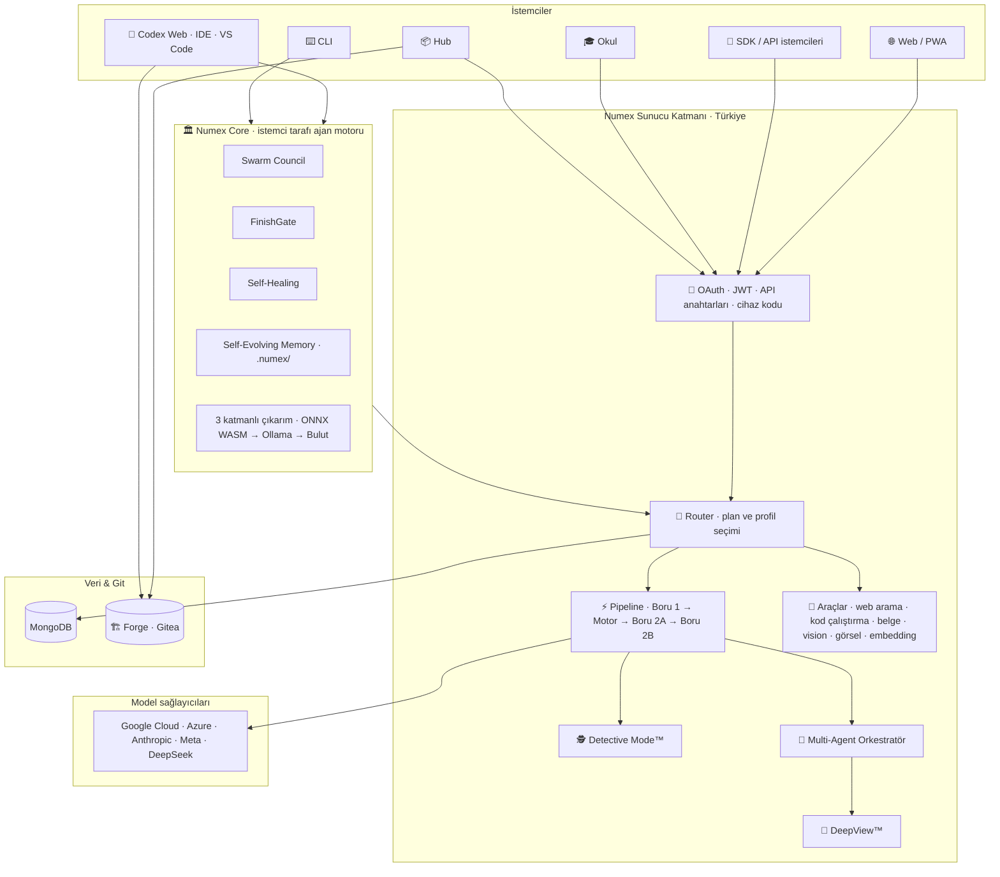

# 🏗️ Numex Mimarisi

## Katmanlar

## Bir isteğin yolculuğu

1. **Kimlik:** OAuth oturumu, JWT veya `nx_live_` API anahtarı doğrulanır.
2. **Router:** Kullanıcının planı ve seçtiği profil (Pro/Fast/Vision/Code) tespit edilir; istek uygun
   işlem hattına yönlendirilir.
3. **Boru 1:** Prompt güçlendirme, bağlam ekleme, uzman talimatları; `@karakter` varsa profil yüklenir.
4. **Mod tespiti:** Kritik soru → **Detective Mode**; çok alanlı soru / 2+ `@uzman` → **DeepView /
   Multi-Agent**; araç gerekiyorsa (web, kod, belge) → **araçlar**.
5. **AI Motor:** İş ortağı model(ler) yanıt üretir.
6. **Boru 2A:** Türkçe düzeltme, format, ton.
7. **Boru 2B:** Kalite kontrol ve doğrulama.
8. **Yanıt:** Akışlı (stream) olarak istemciye; sohbet geçmişi saklanır.

## Ajan tarafı (Core)

Codex ve CLI'de ajan **kullanıcının bilgisayarında** çalışır: dosyaları okur/yazar, komut çalıştırır,
testleri koşar. Sunucudan yalnızca model çağrısı alır. Plan → onay → uygula → **FinishGate kanıtı**
→ hafızaya kaydet döngüsü izlenir. Proje hafızası `.numex/` klasöründe açık dosyalar olarak durur.

## Teknoloji yığını

| Katman | Teknoloji |
|---|---|
| Sunucu | Node.js, Express, MongoDB, Redis, JWT, Passport (Google/GitHub OAuth) |
| Barındırma | Vercel (fra1) + Türkiye'de çift sunucu (2×256 GB RAM, SAS + NAS) |
| Ödeme | İyzico |
| Web arama | Serper |
| Ajan motoru | `@numex-ai/core` — Node 22+, `node:sqlite`, ONNX WASM, Ollama, Playwright |
| Editör | VS Code / VSCodium tabanlı Codex IDE; Monaco (Codex Web); tree-sitter |
| Git | Gitea (Forge) |
