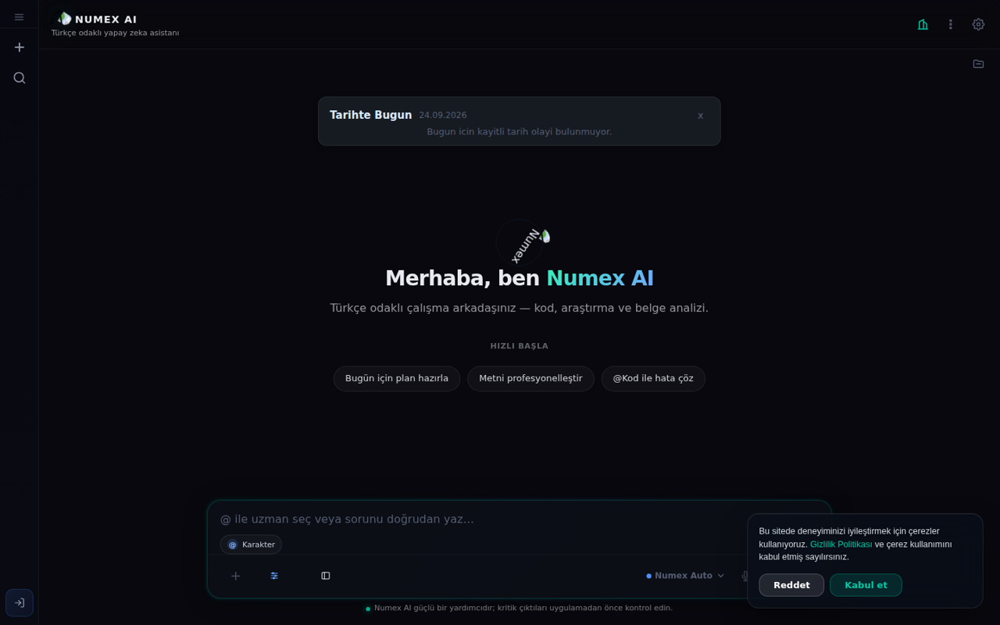
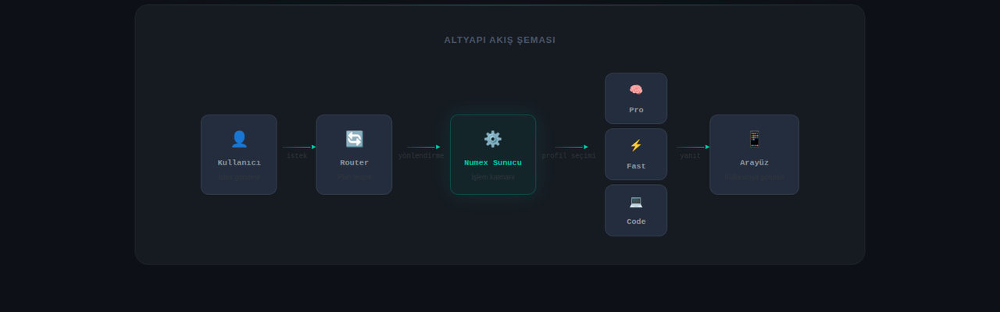
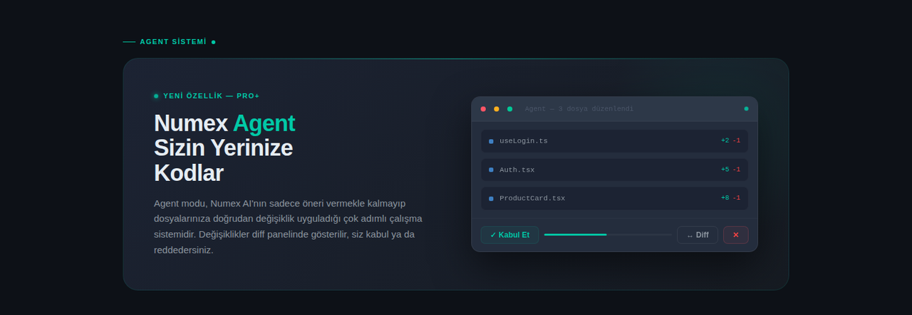
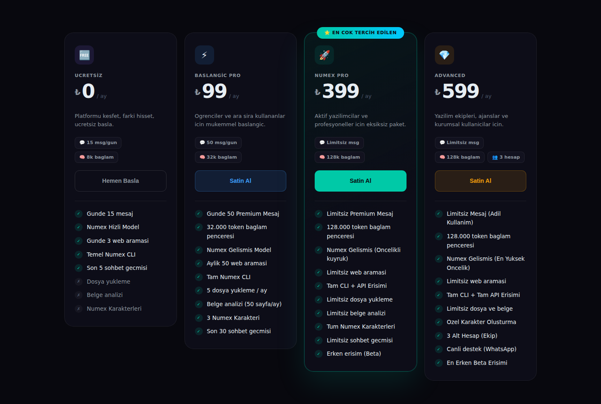
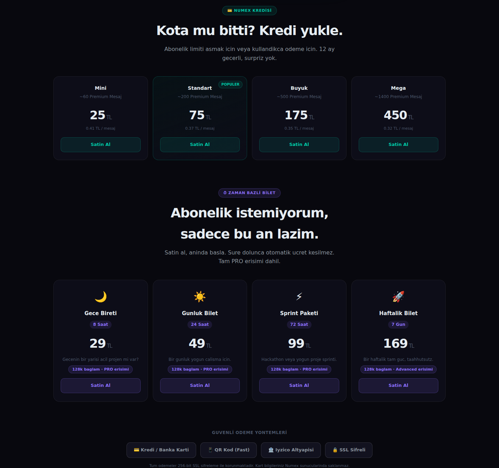

# 🌐 Numex AI Platform — Web & PWA

**Türkçe sohbet, kod, görsel, ses, belge analizi ve web araması — tek arayüzde.**
🔗 [numexai.com.tr](https://numexai.com.tr)

*"Merhaba, ben Numex AI — Türkçe odaklı çalışma arkadaşınız: kod, araştırma ve belge analizi." `@` ile uzman/karakter seçimi, hızlı başla önerileri, Numex Auto model seçici, sesli giriş.*

## Ne yapar?

| Yetenek | Açıklama |
|---|---|
| 💬 **Türkçe sohbet** | Pipeline'dan geçen, doğal ve günlük Türkçe yanıtlar. |
| 💻 **Kod** | Kod yazma, açıklama, debug; canlı önizlemeli **Canvas** alanı ve syntax highlighting'li Codex editörü. |
| 📄 **Belge analizi** | PDF ve Word dosyalarını özetleme, soru sorma, karşılaştırma. |
| 🌐 **Web arama modu** | Güncel bilgiyi arayıp kaynaklı özet; chip seçicilerle mod değişimi. |
| 👁️ **Görsel anlama** | Numex Vision profiliyle görsel analiz ve açıklama. |
| 🎙️ **Sesli giriş & konuşma** | Sesli komut ve sesli sohbet oturumları. |
| 🇹🇷 **Karakterler** | `@FatmaAna`, `@LokmanHekim`, `@MuhasebeciYunus`… ([ayrıntı](08-karakterler.md)) |
| 🕵️ **Detective Mode™** | Kritik sorularda çoklu model + hakem. |
| 🔬 **DeepView™** | Çoklu uzmanla "Master Plan" ve 6 katmanlı düşünce görünümü. |
| 🤖 **Agent modu** | Çok adımlı görevleri planlar, değişiklikleri diff olarak sunar. |
| 🔗 **Paylaşılabilir sohbetler** | Sohbet linkini başkalarıyla paylaşın. |
| 🔔 **Bildirimler** | Uygulama içi güncelleme ve duyurular. |

## Deneyim

- **Kayıt olmadan dene:** Misafir olarak günde 5 mesaj.
- **Tek tıkla giriş:** Google veya GitHub OAuth.
- **PWA:** Giriş yaptıktan sonra telefon veya masaüstüne uygulama olarak ekleyin.
- **Temalar:** Lacivert (varsayılan), Açık, Açık Sade, Sistem.
- **Erişilebilirlik:** Yüksek kontrast, büyük yazı, ekran okuyucu desteği.
- **Mobil öncelikli** tasarım; klavye açıldığında kayma gibi mobil sorunlar v3.1'de giderildi.

## Profiller

| Profil | Ne zaman? |
|---|---|
| 🧠 **Numex Pro** | Uzun bağlam (128K), derin analiz, karmaşık görevler |
| ⚡ **Numex Fast** | Hızlı sohbet, kısa görevler |
| 👁️ **Numex Vision** | Görsellerle çalışma |
| 💻 **Numex Code** | Debug, refactor, test, dokümantasyon |

Arayüzdeki profil, planınıza göre sunucu katmanında uygun işlem hattına otomatik yönlendirilir.

## Örnek kullanımlar

- *"Bu sözleşmedeki fesih maddelerini özetle"* → belge analizi
- *"@MuhasebeciYunus şahıs şirketinde KDV beyannamesi ne zaman verilir?"*
- *"@FatmaAna 4 kişilik, bütçe dostu bir akşam menüsü"*
- *"React componentimde neden memory leak oluşuyor?"* → Detective Mode
- *"@Backend @DevOps @Security bu SaaS için entegre taslak çıkar"* → DeepView Master Plan

## Agent modu

## Planlar

Ücretsiz (₺0) · Başlangıç PRO (₺99) · Numex PRO (₺399) · Advanced (₺599) + kredi paketleri ve
zaman bazlı biletler. → [Ana sayfadaki plan tablosu](../README.md#-planlar-ve-fiyatlar)
