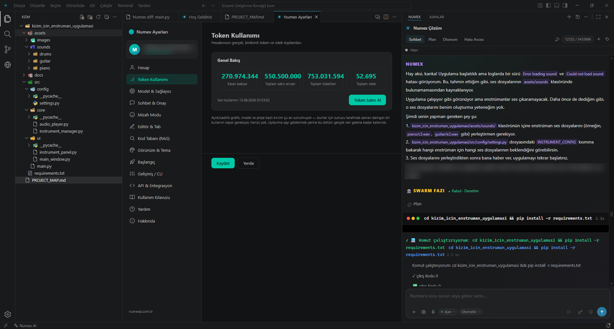
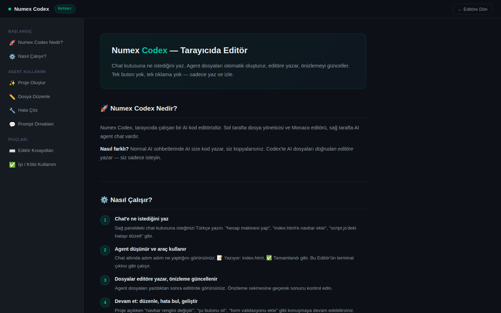

# 🧩 Numex Codex — Web, IDE ve CLI

🔗 **[codex.numexai.com.tr](https://codex.numexai.com.tr)** · IDE **v2.9.59** · CLI **v3.3.10**

> **TÜRKÇE KOD AJANI — Editörüne Türkçe düşünen bir kod ajanı.**
> Türkçe konuşan AI kod editörü. Hazır masaüstü uygulaması, VS Code eklentisi veya komut satırı —
> sana uyanı seç. **İste, yazsın, çalıştırsın — iş bitene kadar.**

| İndir | Komut | Boyut |
|---|---|---|
| ⬇️ **Masaüstüne indir · Windows** (Numex Codex IDE v2.9.59) | `npm i -g @numexai/cli` | ~162 MB · tamamen Türkçe |

```console
$ numex login
✓ Giriş başarılı — hoş geldin 👋
$ numex
◇ Numex Codex — Türkçe kod ajanı hazır
```

Editör içindeki asistanın adı **Numex Çözüm**'dür.


*Solda proje ağacı, ortada Numex Ayarları → Token Kullanımı, sağda Numex Çözüm paneli: ajan hatayı
teşhis ediyor, "SWARM FAZI · Kabul · Denetim" aşamasında plan çıkarıp komutu çalıştırıyor.*


## 🌐 Codex'in üç hali

Numex Codex, aynı **Numex Çekirdeği**'ne üç farklı kapıdan erişir:

| | Nerede? | Kurulum | Kimin için? |
|---|---|---|---|
| 🌐 **Codex Web** | Tarayıcıda | Yok | "Sohbet eder gibi" hızlı proje üretmek ve yayınlamak isteyenler |
| 🧩 **Codex IDE / VS Code eklentisi** | Masaüstü | IDE indir ya da eklenti kur | Profesyonel geliştiriciler |
| ⌨️ **Codex CLI** | Terminal | `npm i -g @numexai/cli` | Terminal, otomasyon, uzak PC ([ayrıntı](02-numex-cli.md)) |

### Codex Web — tarayıcıda editör



> *"Chat kutusuna ne istediğini yaz. Agent dosyaları otomatik oluşturur, editöre yazar, önizlemeyi
> günceller. Tek buton yok, tek tıklama yok — sadece yaz ve izle."*

- **Düzen:** Solda dosya gezgini + **Monaco** editörü, sağda AI ajan sohbeti, altta terminal, ayrı
  **önizleme** sekmesi.
- **Farkı:** Normal sohbette AI kod yazar, siz kopyalarsınız; Codex'te AI **dosyaları doğrudan editöre yazar**.
- **Nasıl çalışır:** ① İsteği Türkçe yaz → ② Ajan adım adım araç kullanır (*📝 Yazıyor: index.html ·
  ✅ Tamamlandı*) → ③ Dosyalar editöre yazılır, önizleme güncellenir → ④ *"navbar rengini değiştir"*
  diye konuşarak geliştirmeye devam.
- **Şablonlar:** Başlangıç · Boş · Todo · Hesap · Dashboard · E-ticaret · Blog · Manav.
- **Hedef platform** (Web / API-Backend / Masaüstü) ve **proje türü** (Muhasebe, Satış/POS, Oyun,
  E-ticaret, Blog, Kurumsal Panel…) seçimi — ajan buna göre mimari kurar.
- **Kod araçları:** 🧠 Kodu analiz et · ⚡ Performans optimizasyonu · 💬 JSDoc yorumları · 🔧 Hata bul & düzelt.
- **Ajan değişiklik kartı:** *"Agent — dosyayı düzenledi +N −M"* → **Kabul Et / Fark / Reddet**;
  isteğe bağlı *otomatik kabul (5 sn)*.
- **Proje:** Kaydet, ZIP indir, URL'den aç, proje yükle, **🚀 Yayınla** — proje tek tıkla herkese
  açık bir adreste yayınlanır.
- **Menüler:** Dosya · Düzenle · Gezgin · Görünüm (komut paleti `Ctrl+K`, önizleme, terminal, sohbet,
  tam ekran) · Terminal (sunucuyu başlat/durdur) · Yardım (`.numex` kuralları, kısayollar).
- **Örnek istekler:** *"profesyonel hesap makinesi yap"* · *"koyu temalı blog sitesi yap"* ·
  *"todo app yap — localStorage kullansın"* · *"Node.js REST API oluştur"* · *"Python ile web scraper yaz"*.

---

## 📑 İçindekiler
1. [Ekran düzeni](#-ekran-düzeni)
2. [Dört çalışma modu: Sohbet · Plan · Otonom · Hata Avcısı](#-dört-çalışma-modu)
3. [Kod yazarken](#️-kod-yazarken)
4. [Kod tabanını anlama (RAG)](#-kod-tabanını-anlama)
5. [Proje hafızası: `.numex/` klasörü](#-proje-hafızası-numex-klasörü)
6. [Git ve kaynak denetimi](#-git-ve-kaynak-denetimi)
7. [Terminal](#️-terminal)
8. [Ajanlar: arka plan, bulut, tarayıcı, Design Mode](#-ajanlar)
9. [Uzak geliştirme (SSH / WSL)](#-uzak-geliştirme)
10. [Ayarlar paneli](#️-ayarlar-paneli)
11. [Tüm komutlar](#-tüm-komutlar)
12. [Kurulum](#-kurulum)
13. [Bir günlük örnek akış](#-bir-günlük-örnek-akış)

---

## 🖥️ Ekran düzeni

```
┌───────────┬──────────────────────────────────┬────────────────────────────┐
│ Gezgin /  │  Editör                          │  NUMEX │ AJANLAR           │
│ Kaynak    │  ◆ Numex: <fonksiyon> hakkında   │  Numex Çözüm               │
│ Denetimi  │    sor   ← Kod Lens               │  [Sohbet][Plan][Otonom]    │
│           │  function ...                    │  [Hata Avcısı]   token ▣   │
│ .numex/   │                                  │  ● Hazır                   │
│  rag/     │                                  │  … ajan mesajları, adımlar │
│  audit/   │                                  │  ┌──────────────────────┐  │
│  …        │                                  │  │ @dosya  /komut       │  │
│           │                                  │  │ + 📷 🎙 Ajan▾ Otomatik▾│ │
├───────────┴──────────────────────────────────┴──┴──────────────────────┴──┤
│ main* · Numex AI · 18 dosya indeksli                      Satır 1, Sütun 1 │
└────────────────────────────────────────────────────────────────────────────┘
```

- **Sağ panel — Numex Çözüm:** "Kod yazma, analiz ve ajan destekli geliştirme asistanınız."
  Boş sohbette hızlı kartlar: **Projeyi tanı** (yapı ve ana dosyalar), **Görselden arayüz üret**
  (ekran görüntüsü → çalışan kod), **Hata bul** (aktif dosyayı incele), **Testleri çalıştır** (sonuçları raporla).
- **Bağlam çipleri:** Giriş kutusunun üstünde aktif dosya (ör. `public/app2.js`) ve çalışma klasörü
  otomatik eklenir. `@` ile dosya, `/` ile komut çağrılır.
- **Giriş çubuğu:** `+` ekle, 📷 ekran görüntüsü, 🎙 sesli giriş, **Ajan ▾** mod seçici,
  **Otomatik ▾** model/onay seçici.
- **Token göstergesi:** Oturumda kullanılan / kalan token (ör. `12418 / 817020`).
- **Durum çubuğu:** Git dalı, Numex AI durumu ve **"N dosya indeksli"** bilgisi.
- **Kod Lens:** Her fonksiyonun üstünde `◆ Numex: <ad> hakkında sor` bağlantısı.

## 🔀 Dört çalışma modu

| Mod | Ne yapar? | Ne zaman? |
|---|---|---|
| 💬 **Sohbet** | Soru-cevap; dosya okur, açıklar, öneri verir. | "Bu proje ne yapıyor?", "Bu fonksiyonu açıkla" |
| 🗺️ **Plan** | Kod değiştirmeden mimari plan ve adım listesi çıkarır. | Büyük özellik öncesi yol haritası |
| 🤖 **Otonom** | Plan → onay → uygula → doğrula döngüsünü kendisi yürütür; komut çalıştırır, dosya yazar. | "Testleri yeşile çek", "Ödeme modülünü ekle" |
| 🐞 **Hata Avcısı** | Hata loglarını, terminal çıktısını ve kodu tarayıp kök nedeni bulur, düzeltme önerir. | "Uygulama açılıyor ama ses yok" |

Ajan her adımı panelde gösterir: *"🔍 7 adım · 2 dosya okundu: router.js, db.json · 2 klasör tarandı ·
63 eşleşme"*. Uzun görevlerde **Swarm fazları** (Plan → Kabul → Denetim) görünür; çalıştırılan her
komut, çıkış koduyla birlikte kart olarak listelenir.

**Örnek — "proje hakkında bilgi ver":** Ajan önce dosya ağacına ve `PROJECT_MAP`'e bakar, sonra
projeyi amaç, teknik omurga (katman → dosya tablosu), API uçları ve iş mantığı başlıklarıyla
Türkçe özetler.

## ✍️ Kod yazarken

| Özellik | Kısayol | Açıklama |
|---|---|---|
| **Satır içi düzenleme** | `Ctrl+K` | Seçili kodu doğal dille değiştir: *"bunu async yap"* |
| **Sonraki düzenleme (Next Edit)** | `Tab` | Bir değişiklik yaptığınızda ilgili sonraki yeri tahmin eder; `Tab` ile uygula, kapatmak için reddet |
| **Satır içi tamamlama** | — | Yazarken gri öneri |
| **Kod Lens sorgusu** | tıkla | `◆ Numex: fonksiyon hakkında sor` |
| **Seçimi sor** | `Ctrl+Alt+N` | Seçili kod bağlamıyla soru |
| **Seçimi açıkla** | sağ tık | Türkçe açıklama |
| **Dosyadaki hataları AI ile düzelt** | ampul menüsü | Tanılama hatalarını toplu düzelt |
| **Composer** | komut | Çok dosyalı değişiklik taslağı |
| **Hunk incelemesi** | — | Değişiklikleri parça parça kabul/ret |
| **Diff sekmesi** | — | `Numex diff: main.py` gibi ayrı sekmede yan yana fark |

## 🔎 Kod tabanını anlama

- **Projeyi indeksle** — leksikal indeks (sembol, dosya özeti, bağımlılık grafiği).
- **Anlamsal arama** — embedding indeksiyle *"ödeme nerede doğrulanıyor?"* gibi doğal dil araması.
- **Kod tabanında ara** — komut paletinden.
- **Tree-sitter** tabanlı sözdizimi ayrıştırma; CLI tarafında **BM25 + AST grafiği**.
- Durum çubuğunda kaç dosyanın indekslendiği görünür.

## 🧠 Proje hafızası: `.numex/` klasörü

Numex her projede şeffaf bir `.numex/` klasörü tutar — ajanın ne bildiği ve ne yaptığı **sizin
diskinizde, okunabilir dosyalarda** durur:

| Dosya / klasör | İçerik |
|---|---|
| `rag/graph.json`, `rag/index.json`, `rag/symbols.json`, `rag/summary.md` | Kod tabanı indeksi, sembol tablosu, bağımlılık grafiği, proje özeti |
| `audit/audit-trail.jsonl` | Ajanın yaptığı her işlemin denetim kaydı |
| `checkpoints/stack.json`, `checkpoints/redo.json` | Geri al / yinele noktaları |
| `mission-state.json`, `async-tasks.json` | Süren otonom misyonlar ve arka plan görevleri |
| `agent-registry.json`, `services.json` | Kayıtlı ajanlar ve çalışan servisler |
| `learned-errors.json`, `error-kb-local.json` | Projede öğrenilen hatalar ve çözümleri |
| `chronicle.jsonl`, `digest.md` | Oturum günlüğü ve özet |
| `project-map-cache.json` | Proje haritası önbelleği |
| `telemetry/token-usage.jsonl`, `sessions/*-usage.json` | Token kullanımı |
| `economy-state.json` | Bütçe / maliyet durumu |
| `logs/` | Ajan logları |

Proje klasörüne geri döndüğünüzde bu hafıza yüklenir; ajan kaldığı yerden devam eder.

## 🔀 Git ve kaynak denetimi

- **Commit mesajı üret** — değişikliklere bakıp anlamlı Türkçe mesaj yazar.
- **Değişiklikleri incele (AI)** — commit öncesi kod incelemesi.
- **Pull Request aç** — başlık ve açıklamayla.
- Kaynak Denetimi panelinde tüm değişen dosyalar, grafik görünümü.

## 🖥️ Terminal

- **Doğal dilden terminal komutu üret:** *"3000 portunu kullanan süreci bul"*
- **Terminal çıktısını sohbete gönder:** Hata çıktısını açıklat / düzelttir.
- Ajan komutları entegre terminalde çalıştırır; çıkış kodlarını raporlar.

## 🤖 Ajanlar

| Ajan | Açıklama |
|---|---|
| **Arka plan ajanı** | Siz başka dosyada çalışırken görevi yürütür. |
| **Bulut ajanı** | Görevi buluta devreder, bilgisayarınız serbest kalır. |
| **Tarayıcı** | Uygulamayı gömülü tarayıcıda açar; ajan arayüzü görerek doğrular. |
| **Design Mode** | Arayüz üzerinde görsel düzenleme. |
| **AJANLAR sekmesi** | Sağ panelde çalışan ajanları izleme. |

Ajanlar [Numex Core](04-numex-core.md) üzerinde çalışır: **Swarm Council** (Mimar · Kodlayıcı · Denetçi ·
Tasarımcı), **Self-Healing** döngüsü ve **FinishGate** (kanıtsız "bitti" yok).

## 🌍 Uzak geliştirme

**SSH** veya **WSL** ile uzak sunucuya bağlanın; başlık çubuğunda *[Uzantı Geliştirme Konağı]* gibi
bağlam gösterilir. Numex Çözüm uzak dosyalarla da aynı şekilde çalışır.

## ⚙️ Ayarlar paneli

**Numex Ayarları** menüleri: Hesap · **Token Kullanımı** (kalan bakiye, toplam satın alınan, toplam
tüketilen, toplam istek; *Token Satın Al*) · Model & Sağlayıcı · Sohbet & Onay · **Mizah Modu** ·
Editör & Tab · Kod Tabanı (RAG) · Görünüm & Tema · Başlangıç · Gelişmiş / CLI · API & Entegrasyon ·
Kullanım Kılavuzu · Yardım · Hakkında. Ayrıca **ekran dili seçimi**.

> Token Kullanımı ekranı yalnızca gerçek verileri gösterir; henüz sunucuda kaydı olmayan grafikler
> "uydurma sayı göstermek yerine" gizlenir.

## 📋 Tüm komutlar

<details>
<summary>Komut paletindeki Numex komutlarını göster</summary>

| Komut |
|---|
| Hoş Geldiniz Sayfası |
| Bu klasörde çalış · Çalışma klasörü seç · Çalışma klasörünü sıfırla |
| Sohbeti Aç/Kapat · Sohbet Paneli · Yeni Sohbet · Sohbet Geçmişi · Transkripti Dışa Aktar |
| Seçimi Sor · Bu Dosya Hakkında Sor · Seçimi Açıkla · Kod Lens Sorgusu |
| Satır-içi Düzenle (Ctrl+K) · Sonraki Düzenlemeyi Uygula (Tab) · Sonraki Düzenleme Önerisini Kapat |
| Projeyi İndeksle · Yeniden İndeksle (leksikal) · Anlamsal Aramayı Aç · Kod Tabanında Ara |
| Ekran Görüntüsü Al ve Sohbete Ekle |
| Terminal Komutu Üret · Terminal Çıktısını Sohbete Gönder |
| Commit Mesajı Üret · Değişiklikleri İncele (AI) · Pull Request Aç |
| Dosyadaki Hataları AI ile Düzelt |
| Otonom Modu Aç/Kapat · Son Yanıtı Tekrar Üret |
| Arka Plan Ajanı Başlat · Bulut Ajanı Başlat · Composer Aç |
| Tarayıcıyı Aç · Design Mode Aç |
| Uzak Sunucuya Bağlan (SSH/WSL) · SSH ile Bağlan · WSL ile Bağlan |
| Ayarlar · Ekran Dilini Seç · Güncellemeleri Denetle · Destek / Hata Bildir |
| Giriş Yap · Çıkış Yap |

</details>

## 📦 Kurulum

**Masaüstü IDE:** [numexai.com.tr](https://numexai.com.tr) → *Numex Ailesi* → **Numex Codex IDE —
Masaüstüne İndir**.

**VS Code eklentisi:**
```bash
npm install -g @numexai/cli
numex login
# ardından VS Code'da Numex Codex eklentisini kurun
```

| Ayar | Varsayılan | Açıklama |
|---|---|---|
| `numex.command` | `numex` | CLI komutu / tam yol |
| `numex.extraArgs` | — | REPL argümanları (ör. `--yolo --lint`) |

## 🗓️ Bir günlük örnek akış

1. Sabah projeyi açarsınız → `.numex/` hafızası yüklenir, durum çubuğu *"18 dosya indeksli"*.
2. **Sohbet:** *"proje hakkında bilgi ver"* → ajan dosya ağacını tarar, Türkçe proje tanıtımı çıkarır.
3. **Plan:** *"abonelik iptal hatırlatıcısı ekle"* → dosya dosya plan.
4. **Otonom:** Planı onaylarsınız → ajan kodu yazar, testleri çalıştırır, FinishGate kanıt ister.
5. **Hata Avcısı:** Konsolda hata → *"Terminal çıktısını sohbete gönder"* → kök neden + düzeltme.
6. **Git:** *Commit mesajı üret* → *Pull Request aç*.
7. Bir şey ters giderse: `numex undo` / checkpoint'ten geri dönüş.

---
← [Ürünler](README.md) · İlgili: [Numex CLI](02-numex-cli.md) · [Numex Core](04-numex-core.md)
