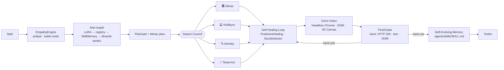

# 🏛️ Numex Core (Corey) — Otonom Ajan Motoru

**`@numex-ai/core`** · Numex ekosisteminin beyni ve motoru. Lisans: MIT

> *"Çekirdek, ekosistemin beyni ve motorudur: bir isteği alıp kodu yazan, sonra durmayıp çalıştıran,
> test eden ve dürüstçe denetleyen otonom ajan."* — Numexpedia

CLI, Codex IDE, VS Code eklentisi, Codex Web ve SDK aynı çekirdeği kullanır. Bu yüzden terminaldeki
komut ile editördeki buton **birebir aynı** davranır.

## Mimari



## Temel yetenekler

| Yetenek | Açıklama |
|---|---|
| 🏛️ **Swarm Council** | Bütçe kontrollü 4 uzman ajan: **Mimar**, **Kodlayıcı**, **Denetçi**, **Tasarımcı**. Dinamik sentez sonrası mimari inceleme. |
| 🧠 **3 katmanlı çıkarım** | **ONNX WASM** (≈25 MB, tamamen yerel) → **Ollama** (yerel LLM) → **Bulut API**. İnternet yokken de çalışabilir. |
| 🔁 **Self-Healing Loop** | 3 turluk otonom hata tespit ve düzeltme döngüsü. |
| 🚦 **FinishGate** | "Tamam/bitti" iddiası **kanıtsız geçemez** — canlı HTTP 200, birim testi veya DOM kontrolü ister. |
| 👁️ **Omni-Vision** | Headless Chrome ile DOM ve 3D Canvas'ı görsel olarak denetler: kod gerçekten çalışıyor mu? |
| 🧩 **NCP Protocol** | Blender 3D, Unity ve Figma için tak-çalıştır eklenti sistemi ([Eklenti mağazası](#-ncp-eklenti-mağazası)). |
| 📚 **Self-Evolving Memory** | Oturumlarda bulunan çözümleri `.agents/skills/SKILL.md` altında saklar; bir dahakine hatırlar. |
| 🗃️ **SQLite Cache** | Node 22+ `node:sqlite`, JSON dosya yedeğiyle önbellek motoru. |
| 🧭 **StuckDetector** | Ajan döngüye girerse devreye girer; kullanıcıya veya web aramasına döner (autoPilot'ta bile). |
| 🩺 **PredictiveHealing** | Sözdizimi, yapı, veri bütünlüğü, JSX parantez dengesi kontrolleri. |
| 🎯 **Zero-Noise Pruning** | Büyük dosyada yalnızca ilgili satırları seçer (örnek: 537 satırda 41 ilgili satır, %92 gürültü filtrelendi). |
| ⚡ **LRU File Cache** | 500 dosya limiti, mtime tabanlı, ~3× hız. |
| 💞 **EmpathyEngine** | Kullanıcının acelesini / kalite beklentisini algılar, önceliklendirir. |
| 🏗️ **E2E Deploy** | Scaffold → `npm install` → sunucu → health check → Playwright tarayıcı doğrulaması. |
| 🎛️ **PlanGate** | API anahtarı + Free/Pro/Enterprise plan limitleri. |
| 🎓 **LoRA Accumulator** | Doğrulanmış çözümlerden JSONL veri seti biriktirir (öz-eğitim döngüsü). |

## Yol haritası seviyeleri

| Seviye | Durum |
|---|---|
| 1 — CLI (terminal, komutlar, REPL) | ✅ |
| 2 — Chat + Tools | ✅ |
| 3 — RAG + Context (kod indeksleme) | ✅ |
| 4 — Otonom kodlama (scaffold, E2E deploy) | ✅ |
| 5 — Swarm Council (4 ajan konseyi, SkillMemory) | ✅ |
| 6 — Sentetik Mimar (meta-reasoning, 12 sektör, öz-eğitim) | ✅ (geliştirme ortamında doğrulandı) |

## Yapılandırma

```js
const core = require('@numex-ai/core');
// autoPilot: true → plan/kod aşamalarında onay beklemeden ilerler.
// StuckDetector her durumda aktif kalır.
```

## 🧩 NCP eklenti mağazası

Çekirdek, NCP eklentilerini keşfetme, arama, `.numex/plugins/` altına indirme, kurma ve kaldırma
desteği içerir. Örnek eklenti türleri: Blender sahne oluşturma/render, Figma tasarımını HTML/CSS'e
dönüştürme. *(Eklenti kataloğu geliştirme aşamasındadır.)*

---
← [Ürünler](README.md) · İlgili: [Codex](03-numex-codex-ide.md) · [CLI](02-numex-cli.md) · [SDK](05-api-ve-sdk.md)
