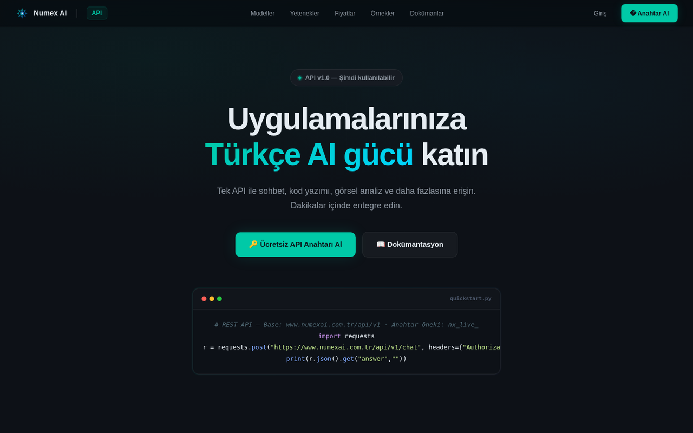

# 🔌 Numex Developer API & Codex SDK

**Uygulamalarınıza Türkçe AI gücü katın.** Tek API ile sohbet, kod, görsel analiz, görsel üretimi,
embedding ve arama.



| | |
|---|---|
| **Sürüm** | API v1.0 |
| **Base URL** | `https://www.numexai.com.tr/api/v1` |
| **Kimlik doğrulama** | `Authorization: Bearer nx_live_…` |
| **Bağlam** | 128K token |
| **Hediye** | İlk kayıtta **100.000 token** — kartsız deneyin |
| **Modeller** | `numex-pro` · `numex-fast` · `numex-think` · `numex-vision` · `numex-code` |
| **Hedefler** | < 200 ms ortalama TTFB · %99,9 uptime hedefi (kurumsal SLA) |

## 🧠 Modeller — "Her görev için doğru model"

| Model | Etiket | Ne için? | Bağlam | Maks. çıktı | Yetenekler |
|---|---|---|---|---|---|
| ⚡ `numex-pro` | **En popüler** | En gelişmiş model: akıl yürütme, yaratıcılık, Türkçe'de en yüksek başarım; karmaşık görevler | 128K | 4K | Vision ✓ · Function calling ✓ |
| 🚀 `numex-fast` | **Hızlı** | Hız ve maliyet odaklı: günlük görevler, sınıflandırma, basit sorgular | 32K | 4K | Vision ✓ · ~3× hızlı |
| 🧠 `numex-think` | **Düşünce** | Derin akıl yürütme: matematik, mantık, strateji, çok adımlı problem çözümü | 128K | 8K | Chain-of-thought |
| 🖼️ `numex-vision` | **Görsel** | Görsel anlama ve analiz: resim açıklama, OCR, görüntü tabanlı görevler | — | — | Image → Text · OCR · Türkçe |
| 💻 `numex-code` | **Kod** | Kod üretimi: otomatik tamamlama, bug fix, code review, refactoring | 64K | 8K | 25+ programlama dili |

> Modeller planınıza göre değişir; yetenekler API referansında ve `GET /api/v1/features` ile doğrulanır.

## 🚀 Hızlı başlangıç

**cURL**
```bash
curl -X POST https://www.numexai.com.tr/api/v1/chat \
  -H "Authorization: Bearer nx_live_ANAHTARINIZ" \
  -H "Content-Type: application/json" \
  -d '{"message":"Merhaba","history":[]}'
```

**Python**
```python
import requests
r = requests.post(
    "https://www.numexai.com.tr/api/v1/chat",
    headers={"Authorization": "Bearer nx_live_ANAHTARINIZ", "Content-Type": "application/json"},
    json={"message": "Merhaba", "history": []},
)
print(r.json().get("answer", ""))
```

**Node.js (Codex SDK)**
```javascript
const { Numex } = require('numexcodex-sdk');
const numex = new Numex({ apiKey: process.env.NUMEX_API_KEY });

const res = await numex.chat.completions.create({
  messages: [{ role: 'user', content: 'Merhaba' }],
});
```

## 📚 Uç noktalar

### Yapay zeka
| Yöntem | Yol | Açıklama |
|---|---|---|
| `POST` | `/chat` | Sohbet yanıtı |
| `POST` | `/chat/stream` | Akışlı (streaming) sohbet |
| `POST` | `/chat/agent` | Ajan modunda çok adımlı görev |
| `POST` | `/vision` | Görsel analiz |
| `POST` | `/images/generations` | Görsel üretimi |
| `POST` | `/embeddings` | Vektör gömme (RAG, anlamsal arama) |
| `POST` | `/search` | Web araması + özet |
| `GET` | `/models` | Kullanılabilir modeller |
| `GET` | `/features` | Hesabınızda açık yetenekler |

### Hesap, anahtar ve kullanım
| Yöntem | Yol | Açıklama |
|---|---|---|
| `GET` | `/me` · `/account` | Hesap bilgisi |
| `GET` / `POST` | `/me/keys` | Anahtarları listele / oluştur |
| `POST` | `/keys/:id/rotate` | Anahtarı döndür (rotate) |
| `POST` | `/keys/:id/activate` | Anahtarı etkinleştir |
| `DELETE` | `/keys/:id` | Anahtarı sil |
| `GET` | `/usage` · `/usage/history` | Token kullanımı ve geçmiş |
| `GET` | `/me/models` · `POST /me/preferred-model` | Model tercihleri |
| `POST` | `/me/test-key` | Anahtar testi |
| `GET` | `/plans` · `POST /subscribe` · `POST /tokens/purchase` · `GET /payments` | Plan, abonelik, token satın alma |

### CLI cihaz girişi
| Yöntem | Yol | Açıklama |
|---|---|---|
| `POST` | `/cli/device` | Cihaz kodu al (`numex login`) |
| `GET` | `/cli/device/:deviceCode` | Onay durumunu sorgula |
| `POST` | `/cli/device/authorize` | Tarayıcıdan onayla |

> Yetenekler plana göre değişir; güncel liste `GET /api/v1/features` ile doğrulanır.

## 🧰 Codex SDK (`numexcodex-sdk`)

```bash
npm install numexcodex-sdk
```

| Kaynak | Metot |
|---|---|
| `numex.chat.completions` | `create({ messages, stream })` |
| `numex.embeddings` | `create({ input })` |
| `numex.images` | `generate({ prompt })` |
| `numex.models` | `list()` |
| `numex.search` | `query({ q })` |

**CLI Bridge — programatik komut çalıştırma**
```javascript
const { Numex, NumexBridge } = require('numexcodex-sdk');

const numex = new Numex({ command: 'numex' });           // PATH'teki CLI
const r = await numex.run(['--help'], { timeout: 60000 });
console.log(r.success ? r.stdout : r.error);

const bridge = new NumexBridge({ command: process.execPath }); // PATH bağımsız
```

Böylece CI hatlarınıza, iç araçlarınıza veya kendi ajanlarınıza Numex CLI'nin tüm otonom gücünü tek
satırla gömebilirsiniz. TypeScript tanımları (`index.d.ts`), CommonJS ve ESM desteği vardır.

## 🔐 Güvenlik notları

- Anahtar yalnızca oluşturulduğunda bir kez gösterilir — güvenli saklayın.
- Anahtarları döndürme (rotate) ve silme desteklenir.
- Anahtarı istemci tarafı koda (tarayıcı JS) gömmeyin; sunucunuzdan çağırın.

## 💳 API erişimi hangi planda?

**Numex PRO** (₺399/ay) → CLI + API · **Advanced** (₺599/ay) → tam CLI + tam API.
Kota biterse **Numex Kredisi** ile kullandıkça ödeyin.

---
← [Ürünler](README.md)
