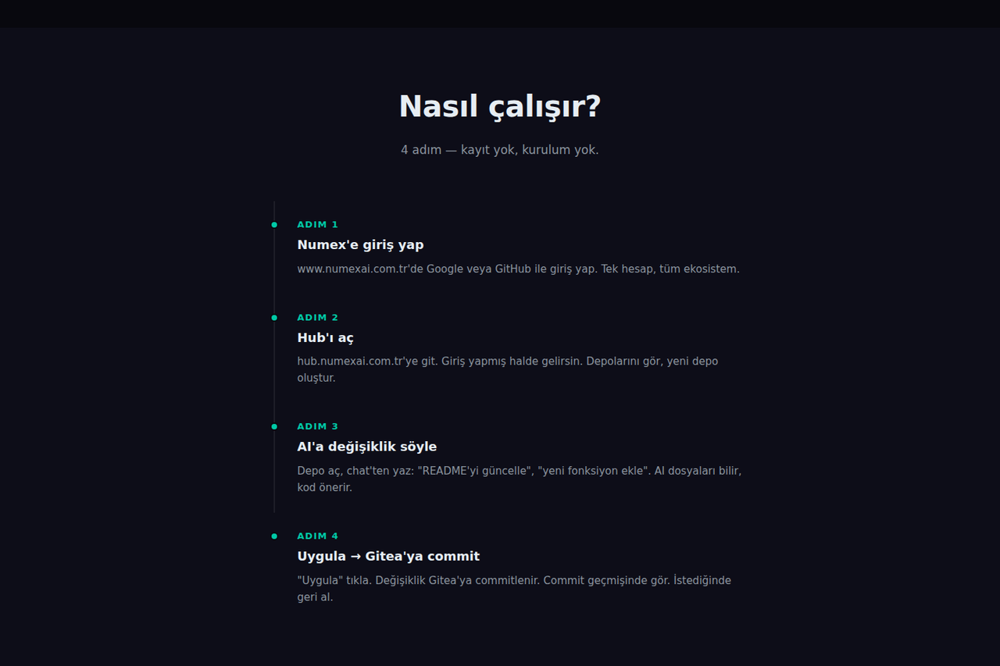
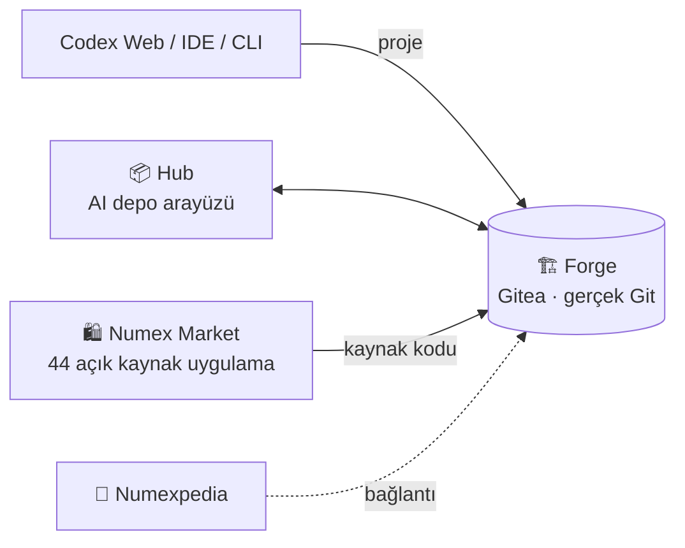

# 📦 Numex Hub & Numex Forge

**Depo yönetimi ve AI destekli geliştirme — tek Numex hesabıyla.**

🔗 **Hub:** [hub.numexai.com.tr](https://hub.numexai.com.tr) · **Forge:** [forge.numexai.com.tr](https://forge.numexai.com.tr)

> Git depolarını oluştur, yönet, AI ile düzenle. Numex'e giriş yap, Hub'ı ve Forge'u otomatik kullan.
> **Ayrı kayıt yok, ayrı şifre yok — tek Numex hesabı, tüm ekosistem.**

## Hub ve Forge'un farkı

| | 🏗️ **Forge** | 📦 **Hub** |
|---|---|---|
| **Ne?** | **Gitea tabanlı Git sunucusu** | Forge'un üzerinde çalışan **AI destekli depo yönetim arayüzü** |
| **Rolü** | Depolar gerçek Git: gerçek commit, gerçek tarih | Depo oluştur, dosya düzenle, AI ile değiştir, commit'le |
| **Benzetme** | "Numex'in GitHub'ı" | "Deposunu bilen yapay zeka editörü" |

## Hub ne yapar?

| Özellik | Açıklama | Durum |
|---|---|---|
| 📦 **Git depo yönetimi** | Depo oluştur, dosyaları düzenle, commit geçmişini gör. Tüm depolar Forge üzerinde. | |
| 🤖 **AI destekli düzenleme** | Sohbetten *"README'yi güncelle"* yaz, AI kod bloğu önersin; onayla, Forge'a commit'lensin. | Beta |
| 🔐 **Tek hesap, tüm ekosistem** | Google veya GitHub ile giriş; Hub ve Forge otomatik açık. | |
| 🏗️ **Forge entegrasyonu** | Gitea tabanlı gerçek Git sunucusu. | Beta |
| 💬 **Depo bağlamlı sohbet** | AI deponun dosyalarını bilir: *"index.js'ye fonksiyon ekle"* → dosyayı okur, değişikliği önerir. | Beta |
| ⚡ **Anlık uygulama** | Öneriyi gör, **Uygula** de → anında commit. Commit SHA'sını gör, geri al. | Beta |

## 🌍 Topluluk Vitrini — `hub.numexai.com.tr/topluluk` *(YENİ)*

> *"Binlerce geliştiricinin inşa ettiği otonom projeleri keşfedin. Kendi vizyonunuzla birleştirin ve
> sınırları kaldırın."*

Hub'ın üst menüsü: **Uygulama Marketi · Topluluk · Dokümantasyon · Panoya Dön**.

| Bölüm | Ne var? |
|---|---|
| ⭐ **Trend Depolar** | Topluluğun öne çıkan depoları: kullanıcı adı, dil etiketi (TypeScript, Python, Rust, CSS…), açıklama, ⭐ yıldız ve 🍴 çatal sayıları |
| 🍴 **Çatalla** | Beğendiğin depoyu tek tıkla kendi hesabına çatalla (fork), üzerine geliştir |
| 🔍 **Depolarda ara** | Topluluk depolarında arama |
| 📡 **Canlı Akış — Canlı Numex Ağı** | Anlık etkinlik: *push*, *fork*, *star*, *PR açtı* — "5 dk önce", "1 saat önce" |

Örnek depo türleri: otonom e-ticaret asistanı, Türkçe NLP/RAG çekirdeği, Windows paketleme CLI'ı,
erişilebilir UI kit.

## Nasıl çalışır? — 4 adım, kurulum yok

1. **Numex'e giriş yap** — numexai.com.tr'de Google veya GitHub ile.
2. **Hub'ı aç** — hub.numexai.com.tr'ye git; giriş yapmış halde gelirsin. Depolarını gör, yeni depo oluştur.
3. **AI'a değişikliği söyle** — depoyu aç, sohbete yaz: *"README'yi güncelle"*, *"yeni fonksiyon ekle"*.
4. **Uygula → Forge'a commit** — değişiklik commit'lenir; geçmişte görünür, istediğinde geri alınır.

## 🏗️ Numex Forge — ayrıntılı

🔗 [forge.numexai.com.tr](https://forge.numexai.com.tr) · **Gitea** tabanlı, **tamamen Türkçe** arayüz.

| Menü | Ne yapar? |
|---|---|
| **Konular** | Issue takibi — hata ve istekler |
| **Değişiklik İstekleri** | Pull request — kod incelemesi ve birleştirme |
| **Kilometre Taşları** | Sürüm / hedef planlama |
| **Keşfet** | Herkese açık **Depolar**, **Kullanıcılar**, **Organizasyonlar** — arama, filtre, sıralama |
| **Pano** | Katkı ısı haritası (son 12 ay), etkinlik akışı, depolarım |
| **Depo / Organizasyon** | Depo oluşturma; Kaynaklar · **Çatallar** · **Yansılar** (mirror) filtreleri; özel/açık depo |

### `numexai` organizasyonundan örnek açık depolar

Numex'in otonom ürettiği uygulamaların kaynak kodu Forge'da herkese açık durur:

| Depo | Açıklama | Dil |
|---|---|---|
| `numex-ilan` | İlan verme, arama ve listeleme özellikli örnek ilan/pazar platformu arayüzü | JavaScript |
| `novax-saat` | Akıllı saat konseptini tanıtan etkileşimli, animasyonlu ürün deneyimi sayfası | HTML |
| `nn-core` | Yapay sinir ağının çekirdeğini görselleştiren etkileşimli demo | JavaScript |
| `depo-yonetim` | Ürün, stok ve depo hareketlerini tek panelden yöneten arayüz | JavaScript |
| `envanter-dokuman` | Bir envanter API'sinin uç noktalarını anlatan interaktif belge sayfası | JavaScript |
| `randevu-sistemi` | Randevu oluşturma, listeleme ve takip arayüzü | JavaScript |
| `resim-duzenleyici` | Tarayıcıda kırpma, filtre ve ayarlarla fotoğraf düzenleme | HTML |
| `kelime-sayaci` | Metindeki kelime, karakter ve cümle sayısını anlık gösteren araç | HTML |
| `markdown-defter` | Markdown not defteri | HTML |

## Ekosistemdeki yeri

**Numex Market**'teki açık kaynak uygulamaların kaynak kodu Forge'da durur; Market, Pedia ve Hub
menülerinde **"Forge'a Git"** bağlantısı bulunur.

---
← [Ürünler](README.md) · İlgili: [Numex Market](13-numex-market.md) · [Codex](03-numex-codex-ide.md)
