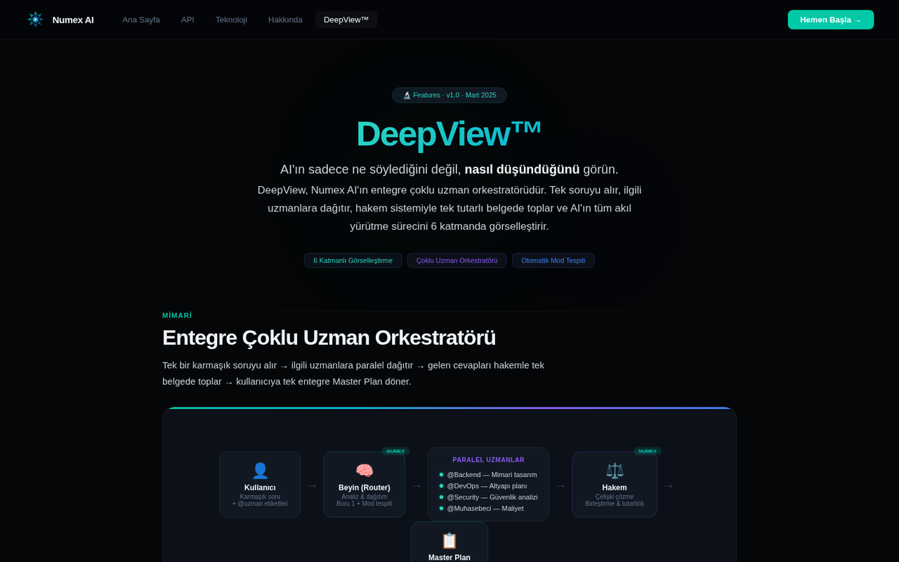
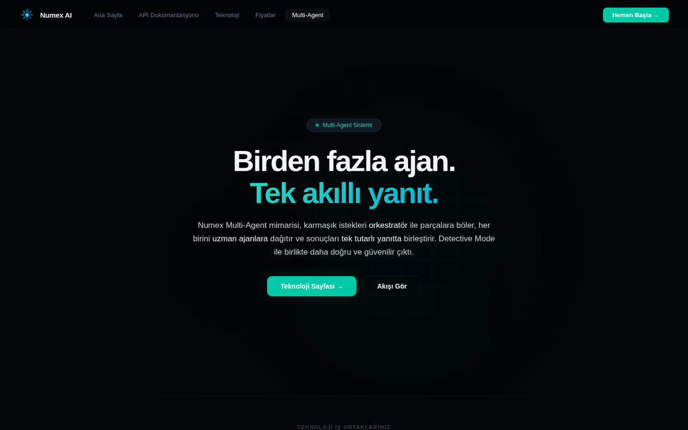

# 🔬 Numex DeepView™

**"AI'ın sadece ne söylediğini değil, nasıl düşündüğünü görün."** · v1.0 · Mart 2025



DeepView, Numex AI'ın **entegre çoklu uzman orkestratörüdür**. Tek soruyu alır, ilgili uzmanlara
paralel dağıtır, hakem sistemiyle tek tutarlı belgede toplar ve akıl yürütme sürecini **6 katmanda**
görselleştirir.

## Mimari


```
👤 Kullanıcı ──▶ 🧠 Beyin (Router) ──▶  Paralel uzmanlar  ──▶ ⚖️ Hakem ──▶ 📋 Master Plan
 karmaşık soru     analiz & dağıtım     @Backend  — mimari        çelişki çözme   tek entegre belge
 + @uzman          Boru 1 + mod tespiti @DevOps   — altyapı       birleştirme     roadmap + matris
                                        @Security — güvenlik
                                        @Muhasebeci — maliyet
```

| Kural | Açıklama |
|---|---|
| **Tetikleyici** | 2+ `@uzman` etiketi veya *"Master Plan"* / *"entegre taslak"* ifadesi |
| **Yedek kural** | 300+ karakter ve birden fazla konu alanı |
| **Garanti** | Tek tek karakter girişleri yok — **tek entegre Master Plan** |

## 6 katman

| # | Katman | Ne gösterir? |
|---|---|---|
| 01 | 💭 **Thought Stream** | Düşünce adımlarını sırayla ve süreleriyle (tüm modlarda aktif) |
| 02 | 🧠 **Reasoning Panel** | Problem → Kök neden → Çözüm → Fayda zinciri |
| 03–06 | 📊 Ara sonuçlar, uzman katkıları, hakem kararları ve nihai plan | Karar sürecinin izlenebilir kaydı |

**Örnek:** *"@Backend @DevOps @Security @Muhasebeci aidat takip SaaS'ı için entegre taslak"* →
mimari, altyapı, güvenlik ve maliyet tek belgede; yol haritası ve karar matrisiyle.

## Detective Mode™ ve Multi-Agent ile ilişkisi



- **Detective Mode™:** Aynı soruyu birden çok model çözer, hakem en doğrusunu seçer.
- **Multi-Agent:** Görevi alt görevlere böler, uzman ajanlara dağıtır, birleştirir.
- **DeepView:** Bu sürecin **görünür** hali — kullanıcı her katmanı izler.

---
← [Ürünler](README.md) · [Mimari](../docs/mimari.md)
