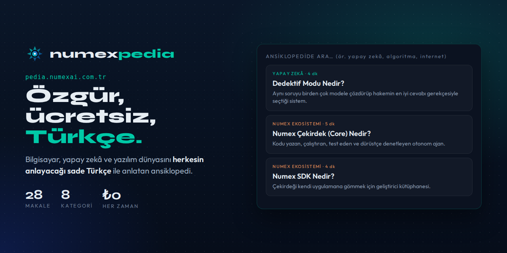

# 📖 Numexpedia — Özgür Türkçe Ansiklopedi

🔗 **[pedia.numexai.com.tr](https://pedia.numexai.com.tr)** · *Özgür · Ücretsiz · Türkçe*

> **Bilgisayar, yapay zeka ve yazılım dünyasını herkesin anlayacağı sade Türkçe ile anlatıyoruz.**
> Öğrenmek isteyen herkes için — ücretsiz ve özgür.

| **28** | **8** | **₺0** |
|:---:|:---:|:---:|
| Makale | Kategori | Her zaman ücretsiz |

## Kategoriler

| Kategori | Makale |
|---|:---:|
| 🧠 Yapay Zeka | 4 |
| 🗂️ Yazılım | 3 |
| `</>` Programlama | 3 |
| 🖥️ Donanım | 2 |
| 🌐 İnternet & Ağlar | 1 |
| 🛡️ Güvenlik | 2 |
| ◆ **Numex Ekosistemi** | **13** |

Her makalede kategori etiketi ve **okuma süresi** (4–5 dk) bulunur; *"Ansiklopedide ara… (ör. yapay
zeka, algoritma, internet)"* kutusuyla aranır.

## Öne çıkan makaleler

| Makale | Özet |
|---|---|
| **Dedektif Modu (Detective Mode) Nedir?** | Aynı soruyu birden çok yapay zeka modeline çözdürüp, bir hakem modelin en iyi cevabı gerekçesiyle seçtiği çok-modelli tartışma sistemi. |
| **Numex Nedir?** | Numex, kod üreten bir araç değil; ürettiği yazılımı kendi kendine doğrulayan, kullanan ve gerektiğinde yeniden geliştiren, yazılımcının yanındaki yerli bir yoldaştır. |
| **Numex Çekirdek (Core) Nedir?** | Ekosistemin beyni ve motoru: bir isteği alıp kodu yazan, sonra durmayıp çalıştıran, test eden ve dürüstçe denetleyen otonom ajan. |
| **Numex Codex Nedir?** | Numex Çekirdeği'ne tarayıcıdan erişilen web istemcisi: kurulum gerektirmeden, sohbet eder gibi kod üretip çalıştırıp yayınlamayı sağlar. |
| **Numex CLI Nedir?** | Numex ajanını doğrudan terminalden çalıştırmayı sağlayan komut satırı arayüzü — otomasyona ve uzak sunuculara en yakın yüz. |
| **Numex SDK Nedir?** | Çekirdeğin yeteneklerini kendi uygulamana gömmek için geliştirici kütüphanesi — ekosistemi kapalı bir uygulama değil, bir platform yapar. |

## Neden Numexpedia?

- **Sade Türkçe:** Teknik kavramlar jargonsuz, herkesin anlayacağı dille.
- **Özgür ve ücretsiz:** Üyelik, ödeme, reklam yok.
- **Ekosistemin el kitabı:** Numex ürünlerinin "nedir?" sayfaları tek yerde.
- **Bağlantılı:** Üst menüden **Market** ve **Forge**'a geçiş.

---
← [Ürünler](README.md)
