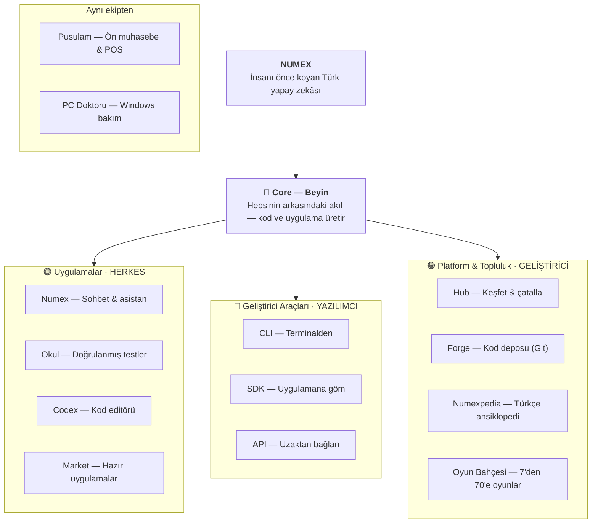

# 👨‍👩‍👧‍👦 Numex Ailesi

🔗 **[numexai.com.tr/aile](https://www.numexai.com.tr/aile)**

> **Tek bir akıl, birçok kapı. Aracın değil, yoldaşın.**
> *Biz bir aileyiz.*

**NUMEX — İnsanı önce koyan Türk yapay zekâsı.**

## Aile üyeleri

### 🟢 Uygulamalar — *herkes için*
| Üye | Rol | Sayfa |
|---|---|---|
| **Numex** | Sohbet & asistan | [→](01-numex-ai-platform.md) |
| **Okul** | Doğrulanmış testler | [→](11-numex-okul.md) |
| **Codex** | Kod editörü | [→](03-numex-codex-ide.md) |
| **Market** | Hazır uygulamalar | [→](13-numex-market.md) |

### 🔶 Geliştirici Araçları — *yazılımcı için*
| Üye | Rol | Sayfa |
|---|---|---|
| **CLI** | Terminalden | [→](02-numex-cli.md) |
| **SDK** | Uygulamana göm | [→](05-api-ve-sdk.md) |
| **API** | Uzaktan bağlan | [→](05-api-ve-sdk.md) |

### 🟢 Platform & Topluluk — *geliştirici için*
| Üye | Rol | Sayfa |
|---|---|---|
| **Hub** | Keşfet & çatalla | [→](06-hub-ve-forge.md) |
| **Forge** | Kod deposu (Git) | [→](06-hub-ve-forge.md) |
| **Numexpedia** | Türkçe ansiklopedi | [→](14-numexpedia.md) |
| **Oyun Bahçesi** | 7'den 70'e oyunlar | [→](16-oyun-bahcesi.md) |

### 🤝 Aynı ekipten
| Üye | Rol | Sayfa |
|---|---|---|
| **Pusulam (PusulamX)** | Ön muhasebe & POS | [→](10-pusulamx.md) |
| **PC Doktoru** | Windows bakım | [→](09-pc-doktoru.md) |

## "Tek akıl" ne demek?

Ailedeki her ürün aynı **Core — Beyin** üzerinde çalışır. Codex'te yazdığınız proje Forge'a gider,
Hub'da çatallanır, Market'te yayınlanır; Okul'daki çift doğrulama, sohbetteki Detective Mode ile aynı
fikirden doğar. **Tek hesap** (Google/GitHub) ile hepsine girilir.

*powered by numexai*

---
← [Ürünler](README.md)
