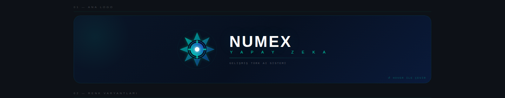
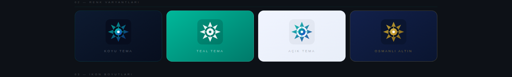
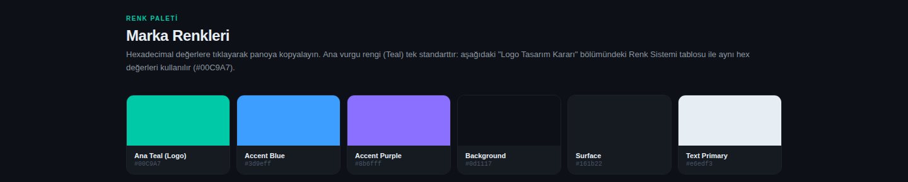
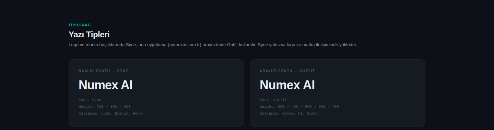

# ✴️ Numex Marka Kimliği — Logonun Gizli Sırrı

*Numex AI — Marka Kiti v2.0 · 2026*

## 🔄 İki kimlik, tek sembol

> *"Normal bakışta gördüğünüz modern AI sembolünü 180° döndürün. Anadolu'nun 900 yıllık geometrik
> mirası karşınıza çıkacak. İki kimlik, tek sembol. Türk zekası ile yapay zekanın birleşimi."*

Numex logosu normal bakışta **modern bir yapay zeka sembolüdür** — merkezdeki göz, nöral ağ
çizgileri, teknoloji. Logo **180° çevrildiğinde** Anadolu'nun kadim geometrisi ortaya çıkar:
**Selçuklu mimarisinin 8 köşeli yıldızı**. Sitede logonun üzerine gelince (hover) bu dönüşü canlı
izleyebilirsiniz. Numex CLI açılışında da aynı sembol görünür: *"◆ Selçuklu yıldızı · İki kimlik, tek sembol"*.

## Neden Selçuklu yıldızı?

| Neden | Açıklama |
|---|---|
| 📐 **Geometrik mükemmellik** | 8 köşeli yıldız tam eksensel simetriye sahiptir; 0°, 45°, 90° ve 180° dönüşlerde dengesini korur — logo her dijital ortamda tutarlıdır. |
| 🏛️ **Kültürel derinlik** | Selçuklular Anadolu'ya matematik, astronomi ve mimari getirdi; Konya, Sivas ve Erzurum medreseleri dönemin bilim merkezleriydi. Yapay zekanın temeli olan hesaplama ve bilimi Türk kültürüyle özdeşleştiren bilinçli bir seçim. |
| 🎯 **Stratejik farklılaşma** | Hilal, tuğra ve Osmanlı motifleri sık kullanılır; Selçuklu geometrisi az bilinen, sofistike ve özgün bir referanstır. Bilen için derin anlam, bilmeyen için merak. |
| 🌍 **Evrensel dil** | 8 köşeli yıldız Bizans sanatında, Hint mimarisinde, Avrupa gotiğinde de görülür — yerli bir platformun küresel bir dil konuşmasını sağlar. |

## Logo anatomisi

| Öğe | Anlam |
|---|---|
| ⚪ **Merkez nokta (beyaz göz)** | Veri, görme ve yapay zekânın zekâsı |
| ➕ **4 eksen çizgisi** | Devre kartı ve nöral ağ referansı — dijital teknoloji hissi |
| ✴️ **8 köşeli yıldız gövdesi** | Normalde soyut AI sembolü; 180° çevrilince Selçuklu yıldızı |
| 🌊 **Teal → lacivert gradyan** | Teknoloji (teal) ile güven ve derinlik (lacivert) dengesi |

## Varyantlar

- **Renk temaları:** Koyu · Teal · Açık · **Osmanlı Altın** (kurumsal ve premium iletişim)
- **İkon boyutları:** 16 · 24 · 32 · 48 · 64 · 96 px
- **Kullanım senaryoları:** Yatay logo (koyu/açık) · App ikonu · Minimal wordmark · Chip logo · Outline logo
- Her varyant **SVG, PNG ve PDF** olarak indirilebilir.

## Renkler

| Renk | Hex | Anlam |
|---|---|---|
| **Ana Teal (Logo)** | `#00C9A7` | Teknoloji, tazelik, inovasyon — tek standart vurgu rengi |
| **Lacivert** | `#0A1628` | Güven, derinlik, prestij |
| **Osmanlı Altını** | `#C9A237` | Kurumsal ve premium iletişim |
| Accent Blue | `#3D9EFF` | Arayüz vurgusu |
| Accent Purple | `#8B6FFF` | Arayüz vurgusu |
| Background | `#0D1117` | Arka plan |
| Surface | `#161B22` | Kart / yüzey |
| Text Primary | `#E6EDF3` | Metin |

## Yazı tipleri

| Kullanım | Font | Ağırlık |
|---|---|---|
| Logo, başlık, hero | **Syne** | 700 / 800 / 900 |
| Arayüz (numexai.com.tr) | **Outfit** | 300 / 400 / 500 / 600 / 700 |

## Doğru kullanım

✅ Koyu zemin üzerinde standart kullanım · ✅ Minimum boyut kuralı · ✅ SVG formatını tercih etmek
❌ Renkleri değiştirmek · ❌ Eğmek / oranını bozmak · ❌ Karmaşık zeminler üzerinde kullanmak

Marka kiti ve lisans için: **destek@numexai.com.tr**

---
← [Ürünler](README.md)
